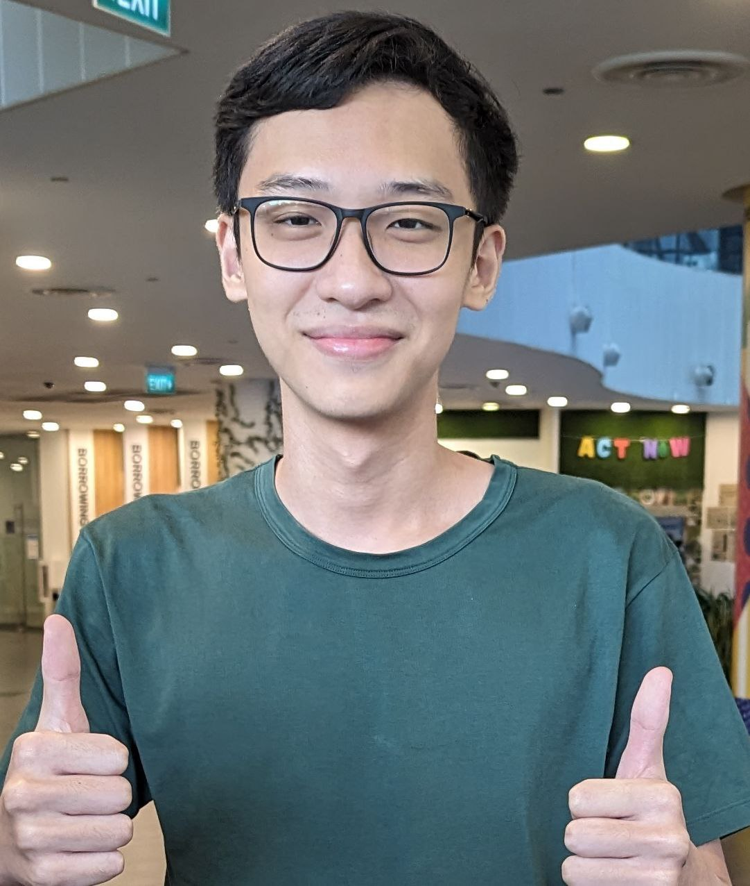
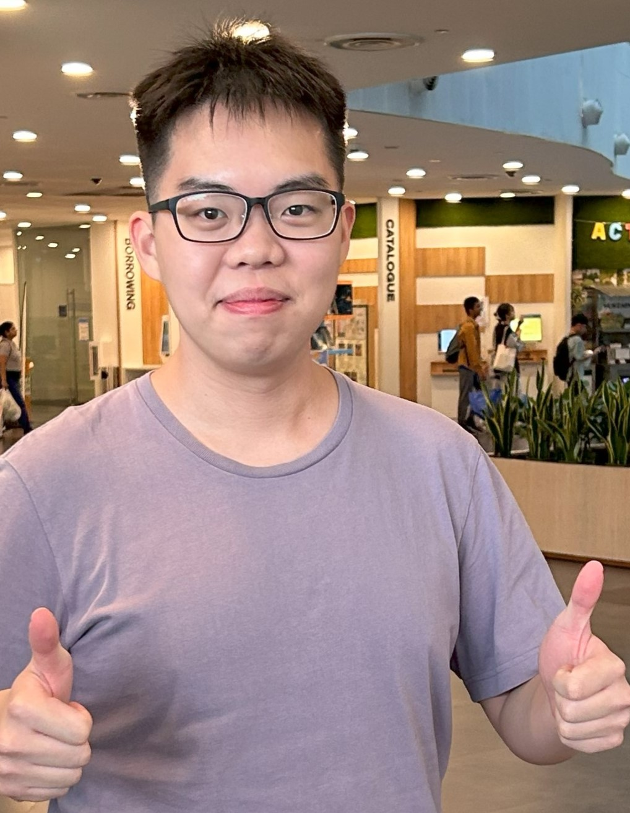
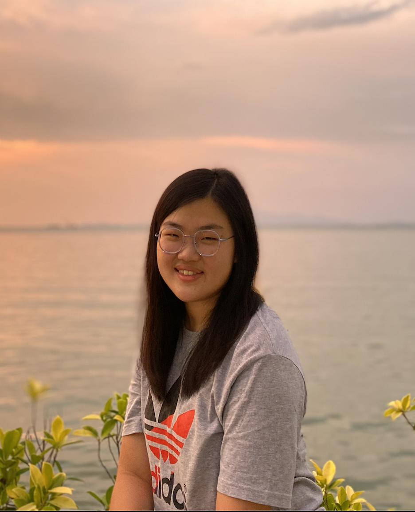
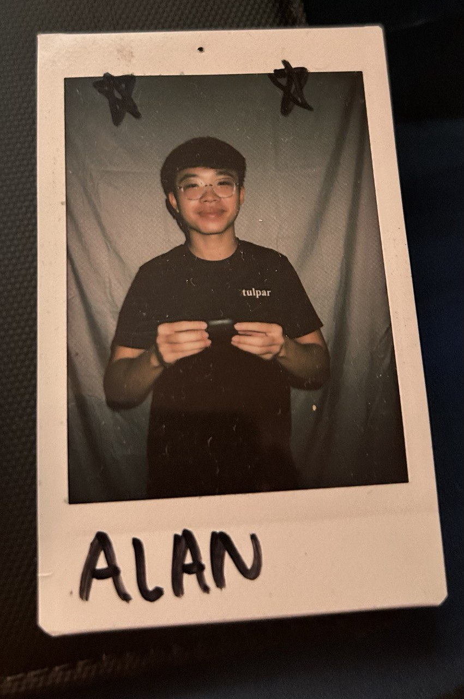

We are a team based in the [School of Computing, National University of Singapore](http://www.comp.nus.edu.sg).

You can reach us at the email `seer[at]comp.nus.edu.sg`

## Project team

### Xing Lingxi

[[github](https://github.com/HugeNoob)]
[[portfolio](team/hugenoob.md)]

* Role: Developer

### Li Jiakai

[[github](https://github.com/jiakai-17)]
[[portfolio](team/jiakai-17.md)]

* Role: Developer
* Responsibilities: In charge of Storage and Documentation

### Johnny Doe

[[github](http://github.com/johndoe)] [[portfolio](team/johndoe.md)]

* Role: Developer
* Responsibilities: Data

### Megan Loo

[[github](http://github.com/m1oojv)]
[[portfolio](team/m1oojv.md)]

* Role: Developer
* Responsibilities: Dev Ops + Threading

### Alan Lim

[[github](http://github.com/freshcabbage123)]
[[portfolio](team/freshcabbage123.md)]

* Role: Developer
* Responsibilities: UI
