<!-- Inject widths for User Story table -->

CoordiMate is a **desktop application** designed specifically for **SoC Computing Club event planners** to help **manage their contacts and tasks** for their events, so that they can focus on the event itself.

This Developer Guide will help you get familiar with the architecture of CoordiMate and understand the implementation details behind some of its features.

---

## **Table of Contents**

* Table of Contents
{:toc}

---

## **Acknowledgements**

[Back to Table of Contents](#table-of-contents)

* CoordiMate is based on the [AddressBook-Level3](https://github.com/se-edu/addressbook-level3) project created by the [SE-EDU initiative](https://se-education.org).
* CoordiMate makes use of the following open source libraries:
  * [JavaFX](https://openjfx.io/) for the Graphical User Interface (GUI).
  * [JUnit 5](https://junit.org/junit5/) for unit testing.
  * [Jackson](https://github.com/FasterXML/jackson) for parsing JavaScript Object Notation (JSON) files.

---

## **Setting up, getting started**

[Back to Table of Contents](#table-of-contents)

Refer to the guide [_Setting up and getting started_](SettingUp.md).

---

## **Design**

[Back to Table of Contents](#table-of-contents)



### Architecture

[Back to Table of Contents](#table-of-contents)

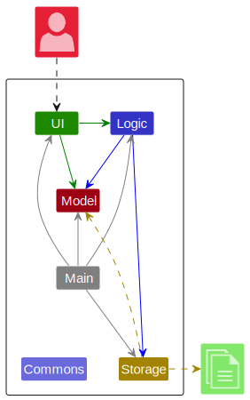

The ***Architecture Diagram*** given above explains the high-level design of the App.

Given below is a quick overview of main components and how they interact with each other.

**Main components of the architecture**

**`Main`** (consisting of classes [`Main`](https://github.com/AY2324S1-CS2103T-T10-2/tp/tree/master/src/main/java/seedu/address/Main.java) and [`MainApp`](https://github.com/AY2324S1-CS2103T-T10-2/tp/tree/master/src/main/java/seedu/address/MainApp.java)) is in charge of the app launch and shut down.

* At app launch, it initializes the other components in the correct sequence, and connects them up with each other.
* At shut down, it shuts down the other components and invokes cleanup methods where necessary.

The bulk of the app's work is done by the following four components:

* [**`UI`**](#ui-component): The UI of the App.
* [**`Logic`**](#logic-component): The command executor.
* [**`Model`**](#model-component): Holds the data of the App in memory.
* [**`Storage`**](#storage-component): Reads data from, and writes data to, the hard disk.

[**`Commons`**](#common-classes) represents a collection of classes used by multiple other components.

**How the architecture components interact with each other**

The *Sequence Diagram* below shows how the components interact with each other for the scenario where the user issues the command `deletePerson 1`.

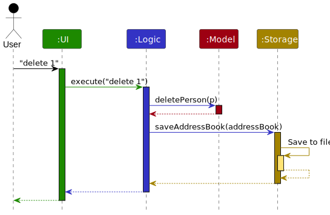

Each of the four main components (also shown in the diagram above),

* defines its *API* in an `interface` with the same name as the Component.
* implements its functionality using a concrete `{Component Name}Manager` class (which follows the corresponding API `interface` mentioned in the previous point.

For example, the `Logic` component defines its API in the `Logic.java` interface and implements its functionality using the `LogicManager.java` class which follows the `Logic` interface. Other components interact with a given component through its interface rather than the concrete class (reason: to prevent outside component's being coupled to the implementation of a component), as illustrated in the (partial) class diagram below.

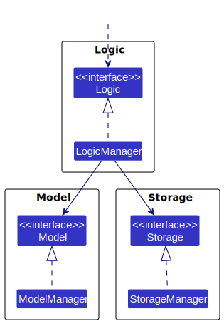

The sections below give more details of each component.

### UI component

[Back to Table of Contents](#table-of-contents)

The **API** of this component is specified in [`Ui.java`](https://github.com/AY2324S1-CS2103T-T10-2/tp/tree/master/src/main/java/seedu/address/ui/Ui.java)

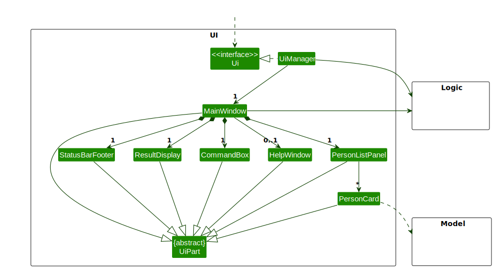

The UI consists of a `MainWindow` that is made up of parts e.g.`CommandBox`, `ResultDisplay`, `PersonListPanel`, `StatusBarFooter` etc. All these, including the `MainWindow`, inherit from the abstract `UiPart` class which captures the commonalities between classes that represent parts of the visible GUI.

The `UI` component uses the JavaFx UI framework. The layout of these UI parts are defined in matching `.fxml` files that are in the `src/main/resources/view` folder. For example, the layout of the [`MainWindow`](https://github.com/AY2324S1-CS2103T-T10-2/tp/tree/master/src/main/java/seedu/address/ui/MainWindow.java) is specified in [`MainWindow.fxml`](https://github.com/AY2324S1-CS2103T-T10-2/tp/tree/master/src/main/resources/view/MainWindow.fxml)

The `UI` component,

* executes user commands using the `Logic` component.
* listens for changes to `Model` data so that the UI can be updated with the modified data.
* keeps a reference to the `Logic` component, because the `UI` relies on the `Logic` to execute commands.
* depends on some classes in the `Model` component, as it displays `Person` and `Task` object residing in the `Model`.

### Logic component

[Back to Table of Contents](#table-of-contents)

**API** : [`Logic.java`](https://github.com/AY2324S1-CS2103T-T10-2/tp/tree/master/src/main/java/seedu/address/logic/Logic.java)

Here's a (partial) class diagram of the `Logic` component:

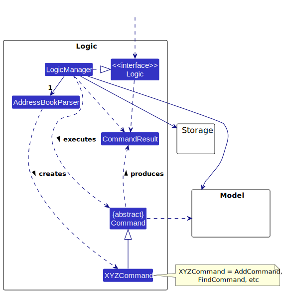

The sequence diagram below illustrates the interactions within the `Logic` component, taking `execute("deleteTask 1")` API call as an example.



The sequence diagrams below show the details of the respective reference frames.

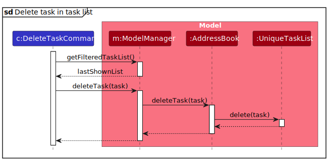

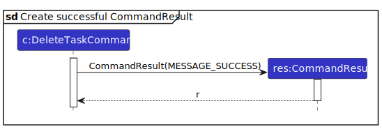

How the `Logic` component works:

1. When `Logic` is called upon to execute a command, it is passed to an `AddressBookParser` object which in turn creates a parser that matches the command (e.g., `DeleteTaskCommandParser`) and uses it to parse the command.
2. This results in a `Command` object (more precisely, an object of one of its subclasses e.g., `DeleteTaskCommand`) which is executed by the `LogicManager`.
3. The command can communicate with the `Model` when it is executed (e.g. to delete a person).
4. The result of the command execution is encapsulated as a `CommandResult` object which is returned back from `Logic`.

Here are the other classes in `Logic` (omitted from the class diagram above) that are used for parsing a user command:

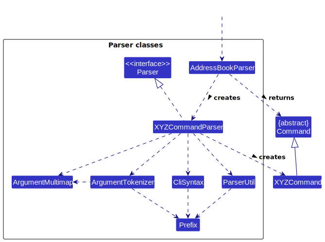

How the parsing works:
* When called upon to parse a user command, the `AddressBookParser` class creates an `XYZCommandParser` (`XYZ` is a placeholder for the specific command name e.g., `AddPersonCommandParser`) which uses the other classes shown above to parse the user command and create a `XYZCommand` object (e.g., `AddPersonCommand`) which the `AddressBookParser` returns back as a `Command` object.
* All `XYZCommandParser` classes (e.g., `AddPersonCommandParser`, `DeletePersonCommandParser`, ...) inherit from the `Parser` interface so that they can be treated similarly where possible e.g, during testing.

### Model component

[Back to Table of Contents](#table-of-contents)

**API** : [`Model.java`](https://github.com/AY2324S1-CS2103T-T10-2/tp/tree/master/src/main/java/seedu/address/model/Model.java)

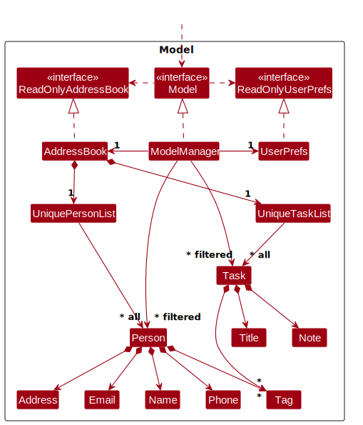

The `Model` component,

* stores the data currently in CoordiMate i.e., all `Person` objects and `Task` objects.
  * These objects are contained in `UniquePersonList` and `UniqueTaskList` objects respectively.
* stores the lists currently 'selected' `Person` and `Task` objects (e.g., results of a search query) as separate _filtered_ lists which is exposed to outsiders as an unmodifiable `ObservableList<Person>` and `ObservableList<Task>` that can be 'observed'.
  * e.g. the UI can be bound to these lists so that the UI automatically updates when the data in the lists change.

* stores a `UserPref` object that represents the user’s preferences. This is exposed to the outside as a `ReadOnlyUserPref` objects.
* does not depend on any of the other three components (as the `Model` represents data entities of the domain, they should make sense on their own without depending on other components)

{% include admonition.html type="note" title="Note" body="

An alternative (arguably, a more OOP) model is given below. It has a <code>Tag</code> list in the <code>AddressBook</code>, which <code>Person</code> references. This allows <code>AddressBook</code> to only require one <code>Tag</code> object per unique tag, instead of each <code>Person</code> needing their own <code>Tag</code> objects.   

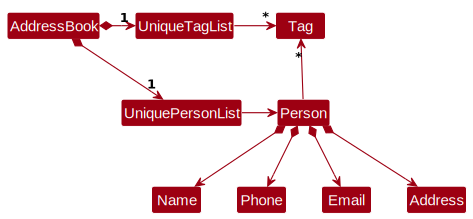

" %}

### Storage component

[Back to Table of Contents](#table-of-contents)

**API** : [`Storage.java`](https://github.com/AY2324S1-CS2103T-T10-2/tp/tree/master/src/main/java/seedu/address/storage/Storage.java)

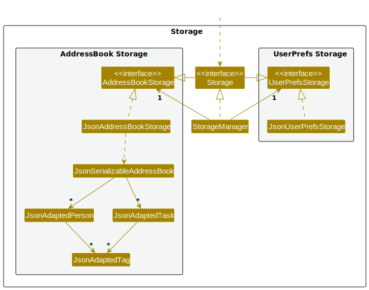

The `Storage` component,
* can save both CoordiMate's data and user preference data in JSON format, and read them back into corresponding objects.
* inherits from both `AddressBookStorage` and `UserPrefStorage`, which means it can be treated as either one (if only the functionality of only one is needed).
* depends on some classes in the `Model` component (because the `Storage` component's job is to save/retrieve objects that belong to the `Model`)

### Common classes

[Back to Table of Contents](#table-of-contents)

Classes used by multiple components are in the `seedu.addressbook.commons` package.

---

## **Implementation**

[Back to Table of Contents](#table-of-contents)

This section describes some noteworthy details on how certain features are implemented.

### Add Tag(s) To Person feature

[Back to Table of Contents](#table-of-contents)

#### Implementation

The `addTagPerson` command is designed to allow users to add tags to existing persons in CoordiMate. It takes in an index to specify which person to add the tags to. It then takes in one or more tags to add to the list of existing tags of the specified person.

To get a visual representation of how the `addTagPerson` command operates, the sequence diagram below provides a detailed overview:

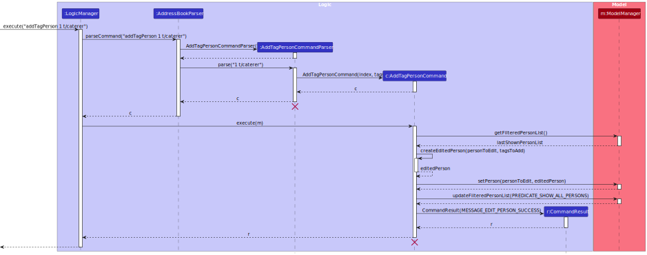



The sequence diagrams below show the details of the respective reference frames.

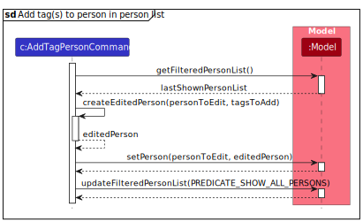

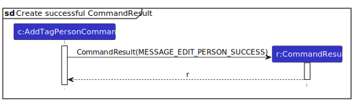

#### Design considerations

**Aspect: Design and format of task display:**

* **Alternative 1:** Simply present tasks using basic string output.
  * Pros: Direct approach and simple to design and implement.
  * Cons: Users are unsure which of their tag inputs are duplicates of current tag in existing list of tags for the specified person and which have been newly added due to their input.   

* **Alternative 2 (current choice):** Present tasks using basic string output and indicates which of the input tags are duplicates of existing tags for the specified person and which have been newly added to the list of tags.
  * Pros: Users are able to identify which of their tag inputs are duplicates of current tag in existing list of tags for the specified person and which have been newly added due to their input.
  * Cons: More complex to design and implement.
  * Cons: Result output is longer and harder to read for users.   

### List Task feature

[Back to Table of Contents](#table-of-contents)

#### Implementation

The `listTask` command is designed to exhibit all tasks currently stored within CoordiMate to the user. It takes in no arguments and provides a straightforward view of all tasks in their current state.

To get a visual representation of how the `listTask` command operates, the sequence diagram below provides a detailed overview:

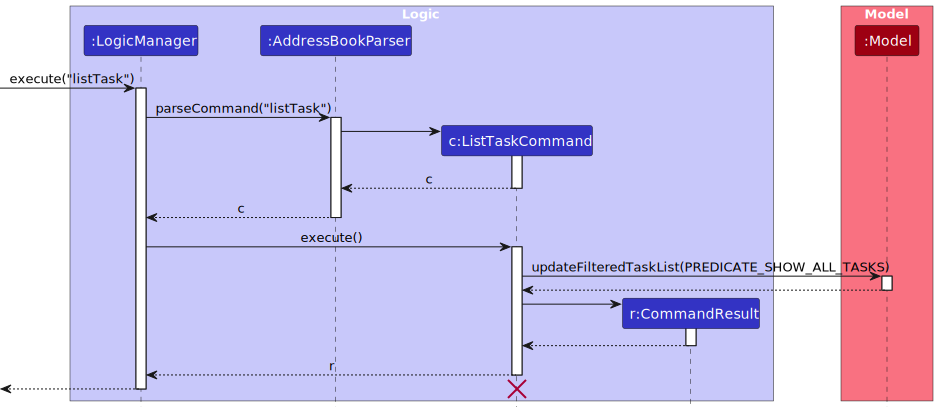



#### Design considerations

**Aspect: Design and format of task display:**

* **Alternative 1:** Simply present tasks using basic string output.
  * Pros: Direct approach and simple to design and implement.
  * Cons: Can seem too plain and might not capture users' attention effectively.   

* **Alternative 2 (current choice):** Offer a more structured and visually enhanced display format for tasks.
  * Pros: Ensures better user engagement due to organized and eye-catching content presentation.
  * Cons: Can be challenging to implement given the added layers of design and subsequent testing.

### Edit Task feature

[Back to Table of Contents](#table-of-contents)

#### Implementation

The `editTask` command accepts an index, title, note, and tags, and edits the task at that index with the new fields. The index should be numeric. The title, note, and tags can be any string. At least one of the title, note, or tag must be provided for the command to be valid.

The sequence diagram below illustrates how the `editTask` command works for the example input `editTask 1 T/title n/note t/tag`.

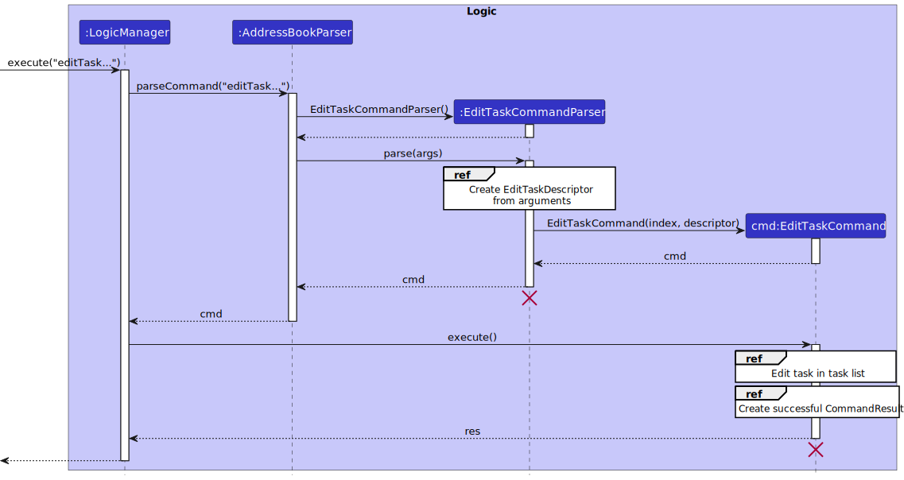



The sequence diagrams below show the details of the respective reference frames.

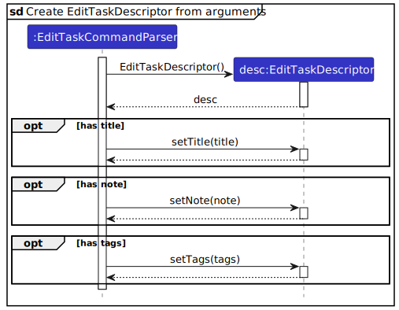

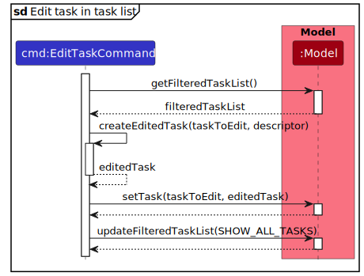

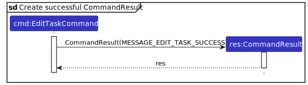

#### Design considerations

**Aspect: How to encapsulate edited fields:**

* **Alternative 1:** Store each edited field in a separate variable directly into `EditTaskCommand` after parsing.
  * Pros: Simple to implement.
  * Cons: Low level of abstraction. Difficult to test, maintain, and extend if more fields are to be added. It is also difficult to pass each field around to classes that need access to the edited fields.    

* **Alternative 2 (current choice):** Encapsulate edited fields in a `EditTaskDescriptor` class.
  * Pros: High level of abstraction. Encapsulation allows the details of an `editTask` command to be passed around as a single object to be used by other classes.
  * Cons: More complex to implement due to boilerplate code.

### Find Task feature

[Back to Table of Contents](#table-of-contents)

#### Implementation

The `findTask` command accepts a String of space-separated keywords, and returns a list of tasks that contain any of their keywords in their title or note. The search is case-insensitive.

The sequence diagram below illustrates how the `findTask` command works.

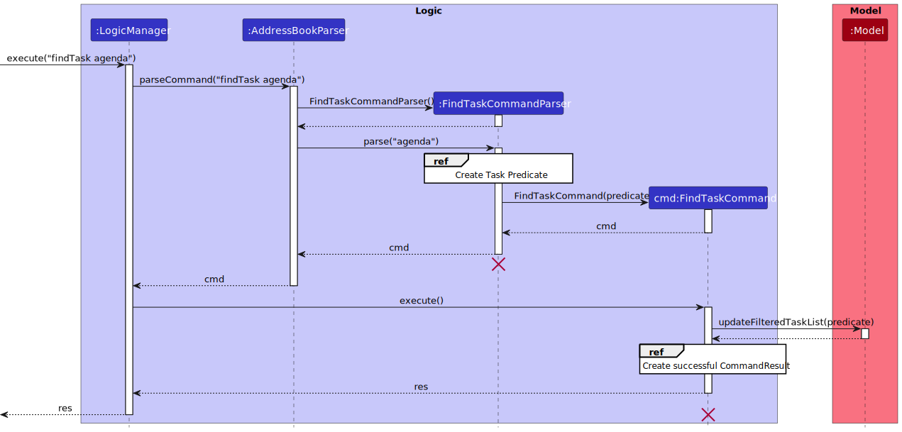



The sequence diagrams below show the details of the respective reference frames.

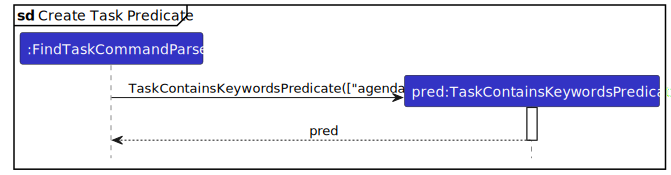

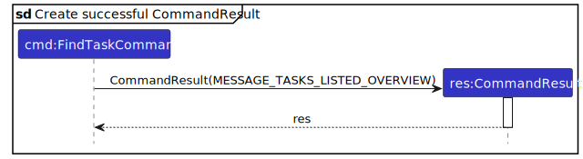

This feature is accomplished by a `TaskContainsKeywordPredicate` class which is used to filter the list of tasks in the `Model` component.

The `TaskContainsKeywordPredicate` class creates two more `Predicate<Task>` objects using the provided search terms, namely, `TitleContainsKeywordPredicate` and `NoteContainsKeywordPredicate`, which are omitted from the diagram above for brevity.

The `TitleContainsKeywordPredicate` object checks if a given task's `Title` contains any of the keywords in the search term.

The `NoteContainsKeywordPredicate` object checks if a given task's `Note` contains any of the keywords in the search term.

These two predicates are used to filter the list of tasks in the `Model` component, by using a short-circuiting OR operation to combine the two predicates.

#### Design considerations

**Aspect: How to implement the `Predicate<Task>` class:**

* **Alternative 1:** Use a single `TaskContainsKeywordPredicate` class that implements `Predicate<Task>` to search both the task's `Title` and `Note`.
  * Pros: Simple to implement.
  * Cons: Not extensible. If we want to search other fields in the future, we will have to modify the `TaskContainsKeywordPredicate` class.   

* **Alternative 2 (current choice):** Use two `Predicate<Task>` classes, namely, `TitleContainsKeywordPredicate` and `NoteContainsKeywordPredicate`, to search the task's `Title` and `Note` respectively.
  * Pros: Extensible. We can easily add more `Predicate<Task>` classes to search other fields in the future.  These classes also allow us to search the task's `Title` and `Note` separately, if needed.
  * Cons: More complex to implement.

### Mark Task feature

[Back to Table of Contents](#table-of-contents)

#### Implementation

The `markTask` command accepts an index and marks the task at that index with task status of **done**. The index should be numeric.

The sequence diagram below illustrates how the `markTask` command works for the example input `markTask 1`.



The activity diagram below models the action sequence of how the `markTask` command works for the example input `markTask 1`.



#### Design considerations

**Aspect: How to create status of a Task:**

* **Alternative 1:** Using String input to create a status.
  * Pros: Simple to implement. Provides flexibility, allowing for dynamic input without changing code.
  * Cons: Can lead to potential issues related to typos or inconsistent naming conventions.
Any string can be passed as a status, potentially resulting in invalid or unexpected states.  

* **Alternative 2 (current choice):** Using an enum input to create a status.
  * Pros: Provides a type-safe way to represent task statuses, ensuring that only valid status values can be used. If new status types are introduced, developers can easily update the TaskStatus enum, ensuring all usages are consistent
  * Cons: More complex to implement. Require modifying the enum itself to add new status types, potentially leading to more extensive code changes   

**Aspect: How to update the task status of a Task:**

* **Alternative 1:** Directly change the status attribute of each task every time it is marked.
  * Pros: More memory-efficient
  * Cons: Not immutable. Can lead to challenges in testing and tracking task state changes over time   

* **Alternative 2 (current choice):** Create a new task with same details and a done status every time it is marked.
  * Pros: Ensures immutability and preserves the history of task states, allowing for easy tracking of changes and maintaining a clear historical record of task statuses.
  * Cons: Incur a slight performance overhead, especially if the tasks contain a large amount of data, impacting the overall execution speed of the program.   

### Delete Task feature

[Back to Table of Contents](#table-of-contents)

#### Implementation

The `deleteTask` command accepts a numeric Index, and removes the task at that index from the task list.

The sequence diagram below illustrates how the `deleteTask` command works for the example input `deleteTask 1`.



The sequence diagrams below show the details of the respective reference frames.

#### Design considerations

**Aspect: How delete executes:**

* **Alternative 1 (current choice):** Deletes task based on the filtered list shown to the user.
  * Pros: Users do not have to use the `listTask` command everytime before they delete a task.
  * Cons: Users cannot delete a task that is not shown in the filtered list.   

* **Alternative 2:** Deletes task based on the full list of tasks.
  * Pros: Users can delete a task that is not shown in the filtered list.
  * Cons: Users have to use the `listTask` command everytime to confirm the index of the task before they delete the task.

---

## **Documentation, Logging, Testing, Configuration, Dev-Ops**

[Back to Table of Contents](#table-of-contents)

* [Documentation guide](Documentation.md)
* [Testing guide](Testing.md)
* [Logging guide](Logging.md)
* [Configuration guide](Configuration.md)
* [DevOps guide](DevOps.md)

---

## **Appendix: Requirements**

[Back to Table of Contents](#table-of-contents)

### Product scope

[Back to Table of Contents](#table-of-contents)

**Target user profile**:

* Has a need to manage various contacts and tasks for event-planning
* Prefers desktop apps over other types
* Is comfortable with CLI apps
* Is able to type fast

**Value proposition**:

CoordiMate helps event planners to easily keep track of contact details as well as the tasks to be done for various events, in a more efficient way compared to a typical mouse/GUI driven app.

### User stories

[Back to Table of Contents](#table-of-contents)

Priorities:

* `* * *` - High (must have)
* `* *` - Medium (nice to have)
* `*` - Low (unlikely to have)

| Priority | As a …​ | I want to …​ | So that I can …​ |
| -------- | -------| ----------- | --------------- |
| `* * *` | new user | see help instructions | refer to documentation to understand the existing features effectively |
| `* * *` | event planner | view both lists on the same screen | compare the task list and contact list while using the GUI |
| `* * *` | event planner | add a new person's details | remember details of new people I meet |
| `* * *` | event planner | list each person's details | view all my contacts' details at a quick glance |
| `* * *` | event planner | edit a person's details | update details of persons that are outdated with new information |
| `* * *` | event planner | find a person by name | locate a specific person without having to go through the entire list |
| `* * *` | event planner | delete a contact | remove contacts that I no longer need |
| `* * *` | event planner | delete all contacts | efficiently restart or declutter my contacts list |
| `* * *` | event planner | add tags to a person | categorise my contacts for easy reference |
| `* * *` | event planner | create tasks to do | know what tasks I need to do in preparation for the event |
| `* * *` | event planner | list each task's details | view all my tasks' details at a quick glance |
| `* * *` | event planner | edit a task | ensure task details are up-to-date with latest information |
| `* * *` | event planner | find a task by name | locate a specific task without having to go through the entire list |
| `* * *` | event planner | delete a task | remove tasks that are no longer relevant |
| `* * *` | event planner | delete all tasks | clear all task entries and restart with a new clean task list |
| `* * *` | event planner | mark a task as done | keep track of task progress and the number of tasks that are done |
| `* * *` | event planner | mark a task as not done | keep track of task progress and the number of tasks that are not done |
| `* * *` | event planner | add tags to a task | categorise my tasks for easy reference |
| `* * *` | event planner | save my data automatically | ensure that my contact and task data will not be lost |
| `* * *` | event planner | load my data automatically | quickly continue from where I left off in the last session |
| `* *` | event planner | find all done tasks | quickly see which tasks I have completed |
| `* *` | event planner | find all not done tasks | quickly see which tasks I have yet to complete |
| `* *` | event planner | delete all done tasks | ensure that my task list is not cluttered with completed tasks |
| `* *` | event planner | list all the tags I have used | avoid creating duplicate categories |
| `* *` | event planner | find a person and tasks by tag | quickly see the persons and tasks in a category |
| `* *` | event planner | add tag(s) to a person | add tag(s) to the existing list of tags of the indexed person |
| `* *` | event planner | add tag(s) to a task | add tag(s) to the existing list of tags of the indexed task |
| `* *` | event planner | delete tag(s) from a person | remove unwanted or outdated tag(s) |
| `* *` | event planner | delete tag(s) from a task | remove unwanted or outdated tag(s) |
{: .user-story-table}

### Use cases

[Back to Table of Contents](#table-of-contents)

For all use cases below, the **System** is `CoordiMate` and the **Actor** is the `user`, unless specified otherwise.

---

**Use case: UC01 - Add a person to the contact list**

**MSS**

1. User requests to add a new person's particulars.
2. CoordiMate adds the person with the specified particulars.

   Use case ends.

**Extensions**

* 1a. The given particulars are invalid.

  * 1a1. CoordiMate shows an error message.

      Use case resumes from step 1.

---

**Use case: UC02 - List all persons in the contact list**

**MSS**

1. User requests to list all persons.
2. CoordiMate shows a list of all persons.

   Use case ends.

---

**Use case: UC03 - Edit a person's details in the contact list**

**MSS**

1. User requests to list all persons.
2. CoordiMate shows a list of persons.
3. User requests to edit a specific person in the list and provides the new particulars.
4. CoordiMate updates the person's details with the new particulars.

   Use case ends.

**Extensions**

* 2a. The list is empty.

   Use case ends.

* 3a. The given index is invalid.

  * 3a1. CoordiMate shows an error message.

      Use case resumes from step 3.

---

**Use case: UC04 - Find a person in the contact list**

**MSS**

1. User requests to search the contacts list with a search term.
2. CoordiMate lists all persons whose names contain the search term.

   Use case ends.

**Extensions**

* 1a. User provides an empty search term.

  * 1a1. CoordiMate shows an error message.

      Use case resumes from step 1.

---

**Use case: UC05 - Delete a person from the contact list**

**MSS**

1. User requests to list all persons.
2. CoordiMate shows a list of persons.
3. User requests to delete a specific person in the list.
4. CoordiMate deletes the person.

   Use case ends.

**Extensions**

* 2a. The contact list is empty.

   Use case ends.

* 3a. The given index is invalid.

  * 3a1. CoordiMate shows an error message.

      Use case resumes from step 3.

---

**Use case: UC06 - Delete all existing contacts**

**MSS**

1. User requests to delete all contacts.
2. CoordiMate deletes all contacts and shows a confirmation message.

   Use case ends.

**Extensions**

* 1a. The contact list is empty.

  * 1a1. CoordiMate informs the user that there are no contacts to be deleted.

      Use case ends.

---

**Use case: UC07 - Add tag to a person in the contact list**

**MSS**

1. User requests to list all persons.
2. CoordiMate shows a list of persons.
3. User requests to add tag(s) to a specific person in the list by index.
4. CoordiMate edits the person to include the specified tag(s).

   Use case ends.

**Extensions**

* 2a. The contact list is empty.

  Use case ends.

* 3a. The given index is invalid.

  * 3a1. CoordiMate shows an error message and prompts the user to enter a valid index.

    Use case resumes from step 3.

* 3b. The given tag(s) are invalid.

  * 3b1. CoordiMate shows an error message and prompts the user to enter valid tag(s).

    Use case resumes from step 3.

---

**Use case: UC08 - Add a task to the task list**

**MSS**

1. User requests to add a task with a title and note.
2. CoordiMate adds the task.

   Use case ends.

**Extensions**

* 1a. No task title or note was provided.

  * 1a1. CoordiMate shows an error message.

      Use case resumes from step 1.

---

**Use case: UC09 - List all tasks in the task list**

**MSS**

1. User requests to list all tasks.
2. CoordiMate shows a list of all tasks.

   Use case ends.

---

**Use case: UC10 - Edit a task in the task list**

**MSS**

1. User requests to list all tasks.
2. CoordiMate shows a list of tasks.
3. User requests to edit a specific task in the list with new details.
4. CoordiMate edits the task with the new details.

   Use case ends.

**Extensions**

* 2a. The task list is empty.

  Use case ends.

* 3a. The given index is invalid.

  * 3a1. CoordiMate shows an error message and prompts the user to enter a valid index.

      Use case resumes from step 3.

---

**Use case: UC11 - Find a task in the task list**

**MSS**

1. User provides a search term.
2. CoordiMate lists all tasks whose names contain the search term.

   Use case ends.

**Extensions**

* 1a. User provides an empty search term.

  * 1a1. CoordiMate shows an error message.

      Use case resumes from step 1.

---

**Use case: UC12 - Delete a task from the task list**

**MSS**

1. User requests to list all tasks.
2. CoordiMate shows a list of tasks.
3. User requests to delete a specific task in the list.
4. CoordiMate deletes the task.

   Use case ends.

**Extensions**

* 2a. The list is empty.

  Use case ends.

* 3a. The given index is invalid.

  * 3a1. CoordiMate shows an error message and prompts the user to enter a valid index.

      Use case resumes at step 3.

---

**Use case: UC13 - Delete all tasks from the task list**

**MSS**

1. User requests to clear all tasks in task list.
2. CoordiMate clears entire task list.

   Use case ends.

**Extensions**

* 1a. The task list is empty.

  * 1a1. CoordiMate informs the user that there are no tasks to be deleted.

      Use case ends.

---

**Use case: UC14 - Mark a task as done**

**MSS**

1. User requests to list tasks.
2. CoordiMate shows a list of tasks.
3. User requests to mark a specific task in the list as done.
4. CoordiMate updates the status of the task to be done.

   Use case ends.

**Extensions**

* 2a. The list is empty.

   Use case ends.

* 3a. The given index is invalid.

  * 3a1. CoordiMate shows an error message.

      Use case resumes from step 3.

* 3b. The specific task is already marked as done.

   Use case ends.

---

**Use case: UC15 - Mark a task as not done**

**MSS**

1. User requests to list tasks.
2. CoordiMate shows a list of tasks.
3. User requests to mark a specific task in the list as not done.
4. CoordiMate updates the status of the task to be not done.

   Use case ends.

**Extensions**

* 2a. The list is empty.

   Use case ends.

* 3a. The given index is invalid.

  * 3a1. CoordiMate shows an error message.

      Use case resumes from step 3.

* 3b. The specific task is already marked as not done.

   Use case ends.

---

**Use case: UC16 - Find all tasks that are done**

**MSS**

1. TODO

   Use case ends.

**Extensions**

* 1a. TODO

  * 1a1. TODO

      Use case ends.

---

**Use case: UC17 - Find all tasks that are not done**

**MSS**

1. TODO

   Use case ends.

**Extensions**

* 1a. TODO

  * 1a1. TODO

      Use case ends.

---

**Use case: UC18 - Delete all tasks that are done**

**MSS**

1. TODO

   Use case ends.

**Extensions**

* 1a. TODO

  * 1a1. TODO

      Use case ends.

---

**Use case: UC19 - Add tag to a task in the task list**

**MSS**

1. User requests to list all tasks.
2. CoordiMate shows a list of tasks.
3. User requests to add tag(s) to a specific task in the list by index.
4. CoordiMate edits the task to include the specified tag(s).

   Use case ends.

**Extensions**

* 2a. The task list is empty.

   Use case ends.

* 3a. The given index is invalid.

  * 3a1. CoordiMate shows an error message and prompts the user to enter a valid index.

      Use case resumes from step 3.

* 3b. The given tag(s) are invalid.

  * 3b1. CoordiMate shows an error message and prompts the user to enter valid tag(s).

      Use case resumes from step 3.

---

**Use case: UC20 - List all tags**

**MSS**

1. User requests to list all tags.
2. CoordiMate shows a list of all tags, with the number of persons and tasks that each tag has.

   Use case ends.

---

**Use case: UC21 - Find all persons and tasks with any matching tag**

**MSS**

1. User requests to find persons and tasks that match any of the given tags.
2. CoordiMate shows the list of persons and tasks that match any of the given tags.

   Use case ends.

**Extensions**

* 1a. All of the given tags do not exist.

   * 1a1. CoordiMate informs the user that there are no persons or tasks that match any of the given tags.

      Use case ends.

* 1b. No persons or tasks match any of the given tags.

   * 1b1. CoordiMate informs the user that there are no persons or tasks that match any of the given tags.

      Use case ends.

* 1c. The provided input for the tag search is invalid.

   * 1c1. CoordiMate shows an error message and prompts the user to provide a valid input for the tag.

      Use case resumes from step 1.

---

**Use case: UC22 - Find all persons and tasks with all matching tags**

**MSS**

1. User requests to find persons and tasks that match all of the given tags.
2. CoordiMate shows the list of persons and tasks that match all of the given tags.

   Use case ends.

**Extensions**

* 1a. All of the given tags do not exist.

   * 1a1. CoordiMate informs the user that there are no persons or tasks that match all of the given tags.

      Use case ends.

* 1b. No persons or tasks match all of the given tags.

   * 1b1. CoordiMate informs the user that there are no persons or tasks that match all of the given tags.

      Use case ends.

* 1c. The provided input for the tag search is invalid.

   * 1c1. CoordiMate shows an error message and prompts the user to provide a valid input for the tag.

      Use case resumes from step 1.

---

**Use case: UC23 - Deleting tag(s) from a person**

**MSS**

1. User requests to list all persons.
2. CoordiMate shows a list of persons.
3. User requests to delete tag(s) from a specific person in the list by index.
4. CoordiMate deletes the tag(s) from the person.
5. CoordiMate informs the user of the deleted tag(s).

   Use case ends.

**Extensions**

* 3a. Some given tag(s) do not exist in the person.

   * 3a1. CoordiMate only deletes the tag(s) that exist.
   * 3a2. CoordiMate informs the user of the deleted tag(s), as well as the tag(s) that do not exist.

      Use case ends.

* 3b. The provided index for the person is invalid.

   * 3b1. CoordiMate shows an error message and prompts the user to provide a valid index for the person.

      Use case resumes from step 3.

---

**Use case: UC24 - Deleting tag(s) from a task**

**MSS**

1. User requests to list all tasks.
2. CoordiMate shows a list of tasks.
3. User requests to delete tag(s) from a specific task in the list by index.
4. CoordiMate deletes the tag(s) from the task.
5. CoordiMate informs the user of the deleted tag(s).

   Use case ends.

**Extensions**

* 3a. Some given tag(s) do not exist in the task.

   * 3a1. CoordiMate only deletes the tag(s) that exist.
   * 3a2. CoordiMate informs the user of the deleted tag(s), as well as the tag(s) that do not exist.

      Use case ends.

* 3b. The provided index for the task is invalid.

   * 3b1. CoordiMate shows an error message and prompts the user to provide a valid index for the task.

      Use case resumes from step 3.

---

**Use case: UC25 - View help instructions**

**MSS**

1. User requests for help.
2. CoordiMate shows the help instructions, with a link to user guide.

   Use case ends.

---

**Use case: UC26 - List all persons and tasks**

**MSS**

1. User requests to list all persons and tasks.
2. CoordiMate shows the list of all persons and tasks.

   Use case ends.

---

**Use case: UC27 - Exit CoordiMate**

**MSS**

1. User requests to exit CoordiMate.
2. CoordiMate exits.

   Use case ends.

---

**Use case: UC28 - Load data from save file**

**MSS**

1. User launches CoordiMate.
2. CoordiMate shows the data from the save file.

   Use case ends.

**Extensions**

* 1a. The save file is missing.

  * 1a1. CoordiMate shows sample data.

      Use case ends.

* 1b. The save file is corrupted.

  * 1b1. CoordiMate shows an error message and shows no entries.

      Use case ends.

* 1c. An error occurs while loading the save file.

  * 1c1. CoordiMate shows an error message and shows no entries.

      Use case ends.

---

**Use case: UC29 - Save data to save file**

**MSS**

1. User makes changes to the data in CoordiMate.
2. CoordiMate indicates that data is successfully saved to the save file.

   Use case ends.

**Extensions**

* 1a. The save file is missing.

  * 1a1. CoordiMate creates a new save file.

      Use case resumes from step 2.

* 1b. An error occurs while saving to the save file.

  * 1b1. CoordiMate shows an error message.

      Use case ends.

---

### Non-Functional Requirements

[Back to Table of Contents](#table-of-contents)

1. Should work on any _mainstream OS_ as long as it has Java `11` or above installed.
2. Should be able to hold up to 1000 persons and tasks without a noticeable sluggishness in performance for typical usage.
3. A user with above average typing speed for regular English text (i.e. not code, not system admin commands) should be able to accomplish most of the tasks faster using commands than using the mouse.
4. Application should be designed for a single user.
5. Data should be stored locally in a human-readable and editable text file.
6. Data should persist across usage sessions.
7. Application should not require internet connection to run.
8. GUI should work well for standard screen resolutions of 1920x1080 and higher, and for screen scales of 100% and 125%.
9. GUI should be usable for resolutions of 1280x720 and higher, and for screen scales of 150%.
10. Application should be packaged and delivered to user in a single JAR file under 100MB.

### Glossary

[Back to Table of Contents](#table-of-contents)

* **API**: Application Programming Interface, a set of predefined functions that a software program can use to interact with another software program.
* **CLI**: Command Line Interface, a way of interacting with a computer program by typing commands and receiving text responses.
* **Exploratory testing**: Testing a feature based on the tester's intuitive understanding of how the feature should function.
* **GUI**: Graphical User Interface, a way of interacting with a computer program by manipulating graphical elements on the screen.
* **JSON**: JavaScript Object Notation, a data format that is widely supported, human-readable and easy for computers to parse.
* **Mainstream OS**: One of these operating systems: Windows, Linux, Unix, OS-X
* **MSS**: Main Success Scenario, which is the most straightforward interaction for a given use case assuming that nothing goes wrong.

---

## **Appendix: Instructions for manual testing**

[Back to Table of Contents](#table-of-contents)

Given below are instructions to test the app manually.

The commands in this section are based on the assumption that the tester is using the sample data provided by CoordiMate.

To reset to the sample data, delete the `data` folder in the same directory as the JAR file, and restart the app.



### Launch and shutdown

1. Initial launch

   1. Download the `CoordiMate.jar` file and copy into an empty folder.

   2. Open a terminal and navigate to the folder you downloaded the JAR file to.

   3. Run the command `java -jar CoordiMate.jar`. 
      Expected: The app launches with a GUI window and has a set of sample contacts and tasks. 

2. Saving window preferences

   1. Resize the window to an optimum size. Move the window to a different location. Close the window.

   2. Re-launch the app by running the command `java -jar CoordiMate.jar`. 
      Expected: The most recent window size and location is retained. 

3. Closing the application by clicking the close button

   1. Click the close button on the top right corner of the window. 
      Expected: The app closes.  

4. Closing the application by typing the `exit` command

   1. Type the command `exit` (alias: `e`) in the command box and press Enter. 
      Expected: The app closes.

### Adding a Person

1. Adding a person to the contact list

   1. Test case: `addPerson n/Daniel Meier p/95352563 e/dan@example.com a/1 Wall Street t/friends` 
      Expected: If a person named `Daniel Meier` exists in the contacts list, then an error message will be shown. Otherwise, a person named `Daniel Meier` with phone number `95352563`, email `dan@example.com`, address `1 Wall Street` and tag `friends` will be added to the contacts list.

   2. Test case: `addPerson n/Emily Meyer p/94825224 e/emily@example.com a/789, Ang Mo Kio Ave 6, #12-111` 
      Expected: If a person named `Emily Meyer` exists in the contacts list, then an error message will be shown. Otherwise, a person named `Emily Meyer` with phone number `94825224`, email `emily@example.com`, address `789, Ang Mo Kio Ave 6, #12-111` and no tags will be added to the contacts list.

   3. Other incorrect commands to try: `addPerson`, `addPerson n/Fiona L. p/12345678 e/fiona@example.com a/123 Circle Ave`, `addPerson n/Fiona Kunz p/12345678`, ... (where one or more parameters, except tags, are missing) 
      Expected: No person is added. An error message is shown.

### Listing all Persons

1. Listing all persons while all persons are being shown

   1. Prerequisites: All persons are listed, and multiple persons in the list.

   2. Test case: `listPerson` 
      Expected: The list of persons shown is unchanged.

2. Listing all persons when some persons are filtered out

   1. Prerequisites: Not all persons are listed (e.g. run the `findPerson bernice` command), and multiple persons in the list.

   2. Test case: `listPerson` 
      Expected: All persons are listed (e.g. persons not having `bernice` in their names are also listed).

### Editing a Person's details

1. Editing a person's details

   1. Prerequisites: All persons are listed, and multiple persons in the list.

   2. Test case: `editPerson 1 n/George Lim` 
      Expected: The name of the first person in the contact list is changed to `George Lim`.

   3. Test case: `editPerson 1 t/` 
      Expected: The tags of the first person in the contact list is cleared.

   4. Other incorrect commands to try: `editPerson`, `editPerson x n/John` (where x is a positive integer larger than the contact list size), `editPerson y n/John` (where y is less than or equal to 0)  
      Expected: No person is edited. An error message is shown.

### Deleting a Person

1. Deleting a person while all persons are being shown

   1. Prerequisites: List all persons using the `listPerson` command. Multiple persons in the list.

   2. Test case: `deletePerson 1` 
      Expected: The first person is deleted from the contact list.

   3. Other incorrect delete commands to try: `deletePerson`, `deletePerson x` (where x is a positive integer larger than the contact list size), `deletePerson y` (where y is less than or equal to 0)  
      Expected: No person is deleted. An error message is shown.

### Finding a Person

1. Finding a person by name

   1. Prerequisites: Multiple persons in the list.

   2. Test case: `findPerson bernice` 
      Expected: If no there are no Persons with `bernice` in their names, an empty list is shown. Otherwise, only Persons with `bernice` in their names are shown.

   3. Other incorrect find commands to try: `findPerson` 
      Expected: No command is executed. An error message is shown.

### Adding tag(s) to a person

1. Adding a tag to a person with multiple tags

   1. Prerequisites: List all persons using the `listPerson` command. Multiple persons in the list.

   2. Test case: `addTagPerson 1 t/caterer` 
      Expected: Tag is added to the first person in the list. Details of the person shown in the result display.

   3. Test case: `addTagPerson 1 t/caterer` followed by `addTagPerson 1 t/caterer t/summer` 
      Expected: Tag is added to the first person in the list. When the second command is run, `summer` is added to
      the first person in the list but `caterer` is not added as a duplicate. Instead `caterer` is returned to the
      result display to already exist for the first person.

   4. Other incorrect addTagPerson commands to try: `addTagPerson`, `addTagPerson 1`, `addTagPerson 1 t/`,
      `addTagPerson x t/caterer` (where x is larger than the list size), `addTagPerson y t/caterer` (where y is less than or equal to 0) 
      Expected: No tag is added to the first person in the list. An error message is shown.

### Deleting a Task

1. Deleting a task while all tasks are being shown

   1. Prerequisites: List all tasks using the `listTask` command. Multiple tasks in the list.

   2. Test case: `deleteTask 1` 
      Expected: The first task is deleted from the task list.

   3. Other incorrect delete commands to try: `deleteTask`, `deleteTask x` (where x is a positive integer larger than the task list size), `deleteTask y` (where y is less than or equal to 0)  
      Expected: No task is deleted. An error message is shown.

### Marking/Unmarking a Task as done

1. Marking a task as done

   1. Prerequisites: Multiple tasks in the list.

   2. Test case: `markTask 1` 
      Expected: If the first task is already marked as done, an error message is shown. Otherwise, the first task is marked as done.

   3. Other incorrect mark commands to try: `markTask`, `markTask x` (where x is a positive integer larger than the task list size), `markTask y` (where y is less than or equal to 0)  
      Expected: No task is marked as done. An error message is shown.

2. Unmarking a task as done

   1. Prerequisites: Multiple tasks in the list.

   2. Test case: `unmarkTask 1` 
      Expected: If the first task is already marked as not done, an error message is shown. Otherwise, the first task is marked as not done.

   3. Other incorrect unmark commands to try: `unmarkTask`, `unmarkTask x` (where x is a positive integer larger than the task list size), `unmarkTask y` (where y is less than or equal to 0)  
      Expected: No task is marked as not done. An error message is shown.

### Adding tag(s) to a task

1. Adding a tag to a task with multiple tags

   1. Prerequisites: List all tasks using the `listTask` command. Multiple tasks in the list.

   2. Test case: `addTagTask 1 t/finance` 
      Expected: Tag is added to the first task in the list. Details of the task shown in the result display.

   3. Test case: `addTagTask 1 t/finance` followed by `addTagTask 1 t/finance t/class` 
      Expected: Tag is added to the first task in the list. When the second command is run, `class` is added to the first task in the list but `finance` is not added as a duplicate.
      Instead `finance` is returned to the result display to already exist for the first task.

   4. Other incorrect addTagTask commands to try: `addTagTask`, `addTagTask 1`, `addTagTask 1 t/`,
      `addTagTask x t/finance` (where x is larger than the list size), `addTagTask y t/finance` (where y is less than or equal to 0) 
      Expected: No tag is added to the first task in the list. An error message is shown.

### Saving/Loading data from data file

1. Saving and loading data from data file

   1. Prerequisites: The data file located at `data/addressbook.json` contains valid data.

   2. Update the data in CoordiMate (e.g. add a person, delete a task, etc.)

   3. Close the app and launch CoordiMate again.  
      Expected: The data from the save file is loaded and shown in the lists. The changes made in step 2 are reflected in the lists.

2. Dealing with corrupted data file

   1. Prerequisites: The data file located at `data/addressbook.json` exists.

   2. Open the data file located at `data/addressbook.json` and add an invalid character to the file. (e.g. Add a `$` character at the start of the file)

   3. Relaunch CoordiMate.  
      Expected: No data is loaded and the lists are empty. An error message is shown in the terminal.

3. Dealing with missing data file

   1. Prerequisites: The data file located at `data/addressbook.json` exists.

   2. Delete the data file located at `data/addressbook.json`.

   3. Relaunch CoordiMate. 
      Expected: Sample data is shown in the lists. After executing a command that modifies the data (e.g. `addPerson`), a new data file is created.

---

## **Appendix: Planned Enhancements**

[Back to Table of Contents](#table-of-contents)

### 1. Character limits for person fields and tasks

- **Enhancement**: Implement character limits for various fields associated with persons and tasks to ensure data consistency and integrity.
- **Reason**: To maintain a structured format for data entry and prevent excessively long inputs that could affect the display and usability of the system.
- **Examples**:
  - For `Person` entities:
    - **Name**: Limit to 1 - 100 characters to ensure the name is detailed enough yet concise.
    - **Phone**: Limit to 3 - 15 characters to accommodate international formats without extraneous digits.
    - **Email**: Limit to 5 - 100 characters to include most valid email addresses while preventing abuse.
    - **Address**: Maximum of 200 characters to include full addresses in a readable format.
  - For `Task` entities:
    - **Title**: Limit to 1 - 100 characters to encapsulate the task effectively.
    - **Note**: Limit to 1 - 200 characters to provide a thorough description without becoming verbose.
  - For `Person/Task` tags:
    - **Tag**: Maximum of 30 characters to keep tags succinct and meaningful.

### 2. Command-specific error messages

- **Enhancement**: Error messages will pinpoint the specific part of the command that has triggered the error.
- **Reason**: Users will be able to identify and correct the exact issue with their command input without having to guess which part was incorrect.
- **Examples**:
    - For an invalid command due to an excessively long or short user input, a possible error message would be "Invalid addPerson command: person's name exceeded 100 characters."
    - For tag-related commands, specifying error messages such as changing "Tag names should be alphanumeric" to "Tag names should be ONLY alphanumeric" for better clarity.

### 3. Stricter validity checks for email addresses

- **Enhancement**: Revise the regex used for validating email addresses to ensure the domain name is present and correctly formatted.
- **Reason**: To prevent the acceptance of invalid email addresses that lack a top-level domain e.g. `.com`, which are not very usable for actual communication.
- **Example**:
  - The current regex might validate `johndoe@example`, which is incorrect as it lacks a domain name. The enhanced regex would correctly invalidate this and require a proper top-level domain, like `johndoe@example.com`.

### 4. Accommodating Special Characters in Person Names

- **Enhancement**: Update the name input validation to allow some special characters that are part of valid names in various cultures, including diacritics and other linguistic markers.
- **Reason**: To ensure the software is inclusive and capable of accurately recording names from a diverse range of ethnic backgrounds.
- **Example**:
  - Under the current system, a name like "Séamus O'Connor" or "Anand Sai-Krishna" might be rejected due to special characters. The enhancement would allow these names to be entered and stored correctly.

### 5. Enhanced UI indicators for empty person/tasks lists

- **Enhancement**: Implement clear and prominent UI indicators when task or person lists are empty, particularly after performing actions such as marking tasks complete.
- **Reason**: To provide immediate and unmistakable visual feedback to users when there are no items to display, enhancing the user experience by avoiding potential confusion or the impression that the list may not have loaded properly.
- **Example**:
  - After a user completes the last remaining task with `markTask` and no incomplete tasks are left, instead of the minimalistic message "0 tasks listed!", the UI could display a more noticeable and friendly graphic or message such as "All tasks complete!" within the task list itself. This visual cue would be both informative and encouraging to the user.

### 6. Preventing list jump on selection

- **Enhancement**: Modify the UI behavior to maintain the current scroll position when selecting an item at the bottom of a list.
- **Reason**: To improve the usability of the application, especially when dealing with long lists, by preventing the list from jumping back to the top after selection.
- **Example**:
  - Currently, when a user selects an item at the bottom of a long list, the list resets to the top position. This enhancement will keep the list at the current scroll position, making it easier to manage and navigate long lists.
  
---

## **Appendix: Effort**

[Back to Table of Contents](#table-of-contents)

TODO
