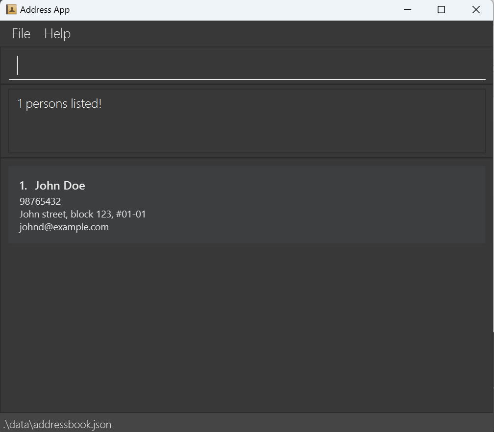
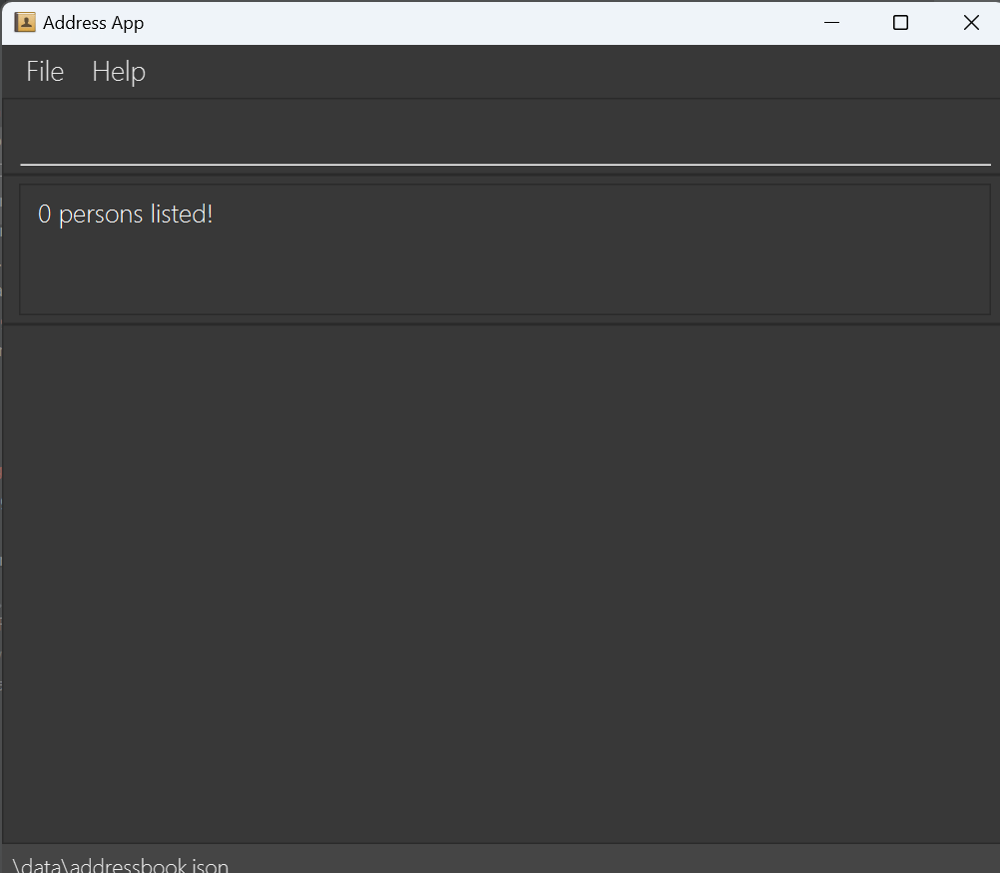

---

{% include admonition.html type="note" title="🚧 Note to self" body="
<b>For each feature, specify the following:</b>
<br>

- precise expected outputs when the command succeeds e.g., changes in the GUI, messages shown to the user <br>
- precise expected outputs when the command fails e.g., what are the error messages shown when a specific parameter is invalid, missing, specified multiple times, etc.<br>
- Relevant UI mock-ups (they can be hand-drawn or created using a tool such as PowerPoint, PlantUML, Figma, etc. -- they can be very low-fidelity mock-ups, as they are
    meant to be temporary)<br>

<br>
TODO Features:
<br>
1. Add contacts of new vendors<br>
2. View all vendors<br>
3. Remove contacts of old vendors<br>
4. Interact using the command line<br>
5. Create tasks to do<br>
6. Remove tasks that are no longer relevant<br>
7. View all tasks<br>
8. Find task by keyword<br>
9. Find contact by name<br>
"%}
















---

<div style="page-break-after: always;"></div>

<h1> CoordiMate User Guide</h1>

Do you have trouble managing contacts?

Don't worry, CoordiMate is here to help!

CoordiMate is a **desktop app for event planners**. It helps you **manage your contacts and tasks** for your events, so that you can focus on the event itself.

CoordiMate is **optimized for use via a Command Line Interface (CLI)** while still having the benefits of a Graphical User Interface (GUI).

If you can type fast, CoordiMate can help you get your contact management tasks done **faster than traditional GUI apps**.

This user guide contains all the information you need to get started with CoordiMate.

<h2> Table of Contents </h2>
* Table of Contents
{:toc}

---

<div style="page-break-after: always;"></div>

## Features

1. CRUD Person
2. Find Person
3. CRUD Task
4. Find Task
5. Auto-save/load to/from disk
    1. AddressBook data are saved automatically as a JSON file `[JAR file location]/data/addressbook.json`.
    2. There is no need to save manually.
6. Editable file format
7. Advanced users are welcome to update data directly by editing that data file.




<div style="page-break-after: always;"></div>


---


## Usage

### 1. Viewing help : `help`

You can access the help page at any time, ensuring that you will never be lost.

Format:

```
help
```

Examples:

- `help`

Output:

- `Open a window, leading you to our user guide.`

  

<div style="page-break-after: always;"></div>


### 2. Adding a person: `addPerson`

Add new people that you meet, be it new clients, vendors or friends.

Format:

```
addPerson n/NAME p/PHONE_NUMBER e/EMAIL a/ADDRESS [t/TAG]…
```



Examples:

- `addPerson n/John Doe p/98765432 e/johnd@example.com a/John street, block 123, #01-01`
- `addPerson n/Betsy Crowe t/friend e/betsycrowe@example.com a/Newgate Prison p/1234567 t/criminal`

Output:


Errors:


<div style="page-break-after: always;"></div>


### 3. Listing all persons : `listPerson`

Presents you with a comprehensive list of contacts in your contact list.

Format:

```
listPerson
```

Examples:

- `listPerson`

Output:


<div style="page-break-after: always;"></div>


### 4. Editing a person : `editPerson`

Enables you to make edits to an existing contact in your contact list.

Format:

```
editPerson INDEX [n/NAME] [p/PHONE] [e/EMAIL] [a/ADDRESS] [t/TAG]…
```

- Edits the person at the specified `INDEX`. The index refers to the index number shown in the displayed person list. The index **_must be a positive integer_** 1, 2, 3, …
- At least one of the optional fields must be provided.
- Existing values will be updated to the input values.
- When editing tags, the existing tags of the person will be removed i.e adding of tags is not cumulative.
- You can remove all the person’s tags by typing `t/` without specifying any tags after it.

Examples:

- `editPerson 1 p/91234567 e/johndoe@example.com` Edits the phone number and email address of the 1st person to be `91234567` and `johndoe@example.com` respectively.
- `editPerson 2 n/Betsy Crower t/` Edits the name of the 2nd person to be `Betsy Crower` and clears all existing tags.

Output:


Errors:

- Incorrect parameters or command format


- Incorrect or missing index


<div style="page-break-after: always;"></div>


### 5. Find specific vendors: `findPerson`

Type in a few keywords linked to a vendor's name, and watch the right details unfold.

Format:

```
findPerson KEYWORD [MORE_KEYWORDS]
```

- The search is case-insensitive. e.g `hans` will match `Hans`
- The order of the keywords does not matter. e.g. `Hans Bo` will match `Bo Hans`
- Only the name is searched.
- Only full words will be matched e.g. `Han` will not match `Hans`
- Persons matching at least one keyword will be returned (i.e. `OR` search).

e.g. `Hans Bo` will return `Hans Gruber`, `Bo Yang`

Examples:

- `findPerson John` returns `john` and `John Doe`
- `findPerson alex david` returns `Alex Yeoh`, `David Li`
- `findPerson alexo davido` returns `0 Persons Listed`

Output:

- There are search outcomes to be displayed.




- There are no search outcomes to be displayed.



Errors:


<div style="page-break-after: always;"></div>


### 6. Deleting a person's contact : `deletePerson`



Erase an outdated vendor from your contact list with ease.

Format:

```
deletePerson INDEX
```

- Deletes the person at the specified `INDEX`.
- The index refers to the index number shown in the displayed person list.
- The index **_must be a positive integer_** 1, 2, 3, …

Examples:

- `listPerson` followed by `deletePerson 2` deletes the 2nd person in the contact list.
- `findPerson Betsy` followed by `deletePerson 1` deletes the 1st person in the results of the `findPerson` command.

Output:


Errors:


<div style="page-break-after: always;"></div>


### 7. Clearing all contacts: `deleteAllPerson`



Clears all contacts in your contact list.

Format:

```
deleteAllPerson
```

Examples:

- `deleteAllPerson`
  - Deletes all persons in your contact list.

Output:

- All persons in the contact list are deleted.

  

<div style="page-break-after: always;"></div>


### 8. Adding a task: `addTask`

Adds a task to your task list.

Format:

```
addTask t/TITLE n/NOTE
```

Examples:

- `addTask t/Get Flowers n/Wedding Anniversary`
- `addTask t/Call Caterers n/Reunion Dinner`

Output:


Errors:


<div style="page-break-after: always;"></div>


### 9. Listing all tasks : `listTasks`

Provides you with a complete list of tasks in your task list.

Format:

```
listTasks
```

Examples:

- `listTask`

Output:


<div style="page-break-after: always;"></div>

### 10. Editing a task : `editTask`

You can edit the details of a task in your task list.

Format:

```
editTask INDEX [t/TITLE] [n/NOTE]
```

- Edits the task at the specified `INDEX`.
- The index refers to the index number shown in the task list currently displayed.
- Specify a new title with the `t/` prefix. This field is **optional**.
- Specify a new note with the `n/` prefix. This field is **optional**.

Examples:

- `editTask 1 t/Call Caterer`
  - Edits the title of the 1st task to be `Call Caterer`.
- `editTask 2 t/Book room n/By Friday`
  - Edits the title of the 2nd task to be `Book room` and the note to be `By Friday`.
- `editTask`
  - Negative example as the index is not specified.

Output:

- Title of task 1 is edited to `Call Caterer`.

  

- Title of task 2 is edited to `Book room` and note is edited to `By Friday`.

  

Errors:

- Index is not specified.

  

<div style="page-break-after: always;"></div>

### 10. Find specific task: `findTask`

You can locate tasks containing your specified keywords in their names.

Format:

```
findTask KEYWORD [MORE_KEYWORDS]
```

- The search is case-insensitive. e.g `call` will match `Call`
- The order of the keywords does not matter. e.g. `Call Caterer` will match `Caterer Call`
- Only the name is searched.
- Only full words will be matched e.g. `Call` will not match `Calls`
- Tasks matching at least one keyword will be returned (i.e. `OR` search).

Examples:

- `findTask Call` returns `call` and `Call Caterer`
- `findTask Call Caterer` returns `Call Flower`, `Caterer Find`

Output:
- There are search outcomes to be displayed.
  

- There are no search outcomes to be displayed.
  

Errors:


<div style="page-break-after: always;"></div>


### 12. Deleting a task : `deleteTask`



You can remove a task from your task list.

Format:

`deleteTask INDEX`

- Deletes the task at the specified `INDEX`.
- The index refers to the index number shown in the task list currently displayed.

Examples:

- `deleteTask 2`
  - Deletes the 2nd task in the task list.
- `findTask Call` followed by `deleteTask 1`
  - Deletes the 1st task in the results of the `findTask` command.

Output:

- Deletes task 2.

  

Errors:

- Index specified is not available in the task list.

  


<div style="page-break-after: always;"></div>


### 12. Exiting the program : `exit`

You can exit the program.

Format: `exit`

<div style="page-break-after: always;"></div>

## FAQ



<div style="page-break-after: always;"></div>

## Known issues


