Are you a School of Computing (SoC) Computing Club event planner juggling numerous tasks and contacts for your upcoming events?

Managing everything efficiently just got easier with CoordiMate!

CoordiMate is your go-to **desktop app** designed specifically for **SoC Computing Club event planners** to help you **manage your contacts and tasks** for your events, so that you can focus on the event itself.

And here's the best part – while it's perfect for members of SoC Computing Club, **event planners of all kinds** can benefit from CoordiMate's powerful features too!

<h4>Why choose CoordiMate?</h4>

1. **User-Friendly Command Line Interface (CLI)**: CoordiMate is optimized for use via a CLI, combining all the benefits of a Graphical User Interface (GUI) with the efficiency of a CLI.

2. **Speedy Navigation**: If you're a fast typist, CoordiMate will help you complete your contact and tasks management faster than traditional GUI apps, maximising your productivity.

Don't let the stress of contact and task management hinder your event planning creativity.

Let **CoordiMate** take care of the details, while you craft extraordinary events with confidence.

## Using This Guide

This document will guide you on the various features of CoordiMate and how to use them.

If you are a new user, we recommend that you read this guide starting from the [Quick Start](#quick-start) section.

If you are an experienced user, you can use the [Table of Contents](#table-of-contents) below to quickly locate the relevant section. Alternatively, you can jump to the [Command Summary](#command-summary) section for an overview of the command syntax.

Here are some annotations used in this guide:











Throughout this guide, you will see different text styles that are used to highlight important information.

- <a href="javascript: void(0)">Text in blue</a> are links which you can click on to jump to the relevant section.
- `Text with light blue background` are commands or file names which are used for CoordiMate.

---

<div style="page-break-after: always;"></div>

## Table of Contents

- Table of Contents
{:toc}

---

<div style="page-break-after: always;"></div>

## Quick Start

1. Ensure you have Java `11` or above installed in your computer.

2. Download the latest `CoordiMate.jar` from [here](https://github.com/AY2324S1-CS2103T-T10-2/tp/releases).

3. Copy `CoordiMate.jar` to the folder you want to use as the _home folder_ for CoordiMate. This folder will be used by CoordiMate to store its data.

4. Open a command terminal, `cd` into the folder you put `CoordiMate.jar` in, and use the `java -jar CoordiMate.jar` command to start CoordiMate.<br>

   A GUI similar to the below screenshot should appear in a few seconds. Note how the app contains some sample data.<br><br>
   

5. Type the command in the command box and press Enter to execute it. e.g. typing **`help`** and pressing Enter will open the help window.<br><br>

   Some example commands you can try:

   * `listPerson` : Lists all persons.

   * `addPerson n/John Doe p/98765432 e/johnd@example.com a/John street, block 123, #01-01` : Adds a new contact named `John Doe` with the specified details.

   * `deletePerson 3` : Deletes the 3rd contact shown in the current contact list.

   * `findTask caterer` : Finds all tasks with the word `caterer` in their title or note.

   * `listTask` : Lists all tasks.

   * `addTask T/Get Flowers n/Wedding Anniversary` : Adds a task titled `Get Flowers` with note `Wedding Anniversary` to the task list.

   * `markTask 1` : Marks the 1st task shown in the current task list as done.

   * `exit` : Exits the app.

6. Refer to the [Usage](#usage) section below for details of each command.

---

<div style="page-break-after: always;"></div>

## Features

1. **Easy Management of People**:
    - Seamlessly create, update, and delete person records. CoordiMate ensures your contact list is always up-to-date, putting people at the heart of your event planning.
2. **Quick Person Search**:
    - Find specific individuals effortlessly. No more digging through piles of data. With CoordiMate, finding the right person is just a search away, making your interactions more personal and meaningful.
3. **Effortless Task Control**:
    - Manage tasks without the fuss. CoordiMate's intuitive interface lets you handle tasks with ease. From creation to completion, stay in control of every event detail.
4. **Simplified Task Tracking**:
    - Easily locate tasks based on your criteria. CoordiMate streamlines your search, ensuring you stay organized and focused on tasks that matter most to you and your attendees.
5. **Hassle-Free Data Handling**:
    - Automatic Data Management:
      - CoordiMate takes care of saving and loading data for you. No need to worry about manual saves; your information is secure and ready whenever you are.
      - Saved data safely as a JSON file located at `[JAR file location]/data/CoordiMate.json`.
    - Startup Ready:
      - Instantly pick up where you left off. CoordiMate loads your existing data upon startup, eliminating downtime and ensuring you're always in the loop.
6. **Empowering User Control**:
    - Editable File Format:
      - For advanced users, CoordiMate offers complete data control. Tailor your event data directly by editing the data file, putting you in charge of your event management.

With these user-centric features, CoordiMate empowers you to focus on what truly matters: creating exceptional events and nurturing valuable connections. Experience event planning made personal, efficient, and stress-free with CoordiMate!



---

<div style="page-break-after: always;"></div>

## Usage

{% include admonition.html type="note" title="Note: About Command Formats" body="

<ul>
  <li>
    <p>
      Words in <code>UPPER_CASE</code> are the parameters to be supplied by the user.<br>
      e.g. in <code>addPerson n/NAME</code>, <code>NAME</code> is a parameter which can be used as <code>addPerson n/John Doe</code>, where <code>John Doe</code> is the value of the parameter <code>NAME</code>. <br>
    </p>
  </li>

  <li>
    <p>
      Items in square brackets are optional.<br>
      e.g <code>n/NAME [t/TAG]</code> can be used as <code>n/John Doe t/friend</code> or as <code>n/John Doe</code>.<br>
      Note that the square brackets (<code>[</code> and <code>]</code>) are not part of the syntax.
    </p>
  </li>

  <li>
    <p>
      Items in square brackets with <code>…</code> after them can be used multiple times, including zero times.<br>
      e.g. <code>[t/TAG]…​</code> can be used as <code> </code> (i.e. 0 times), <code>t/friend</code>, <code>t/friend t/family</code> etc.
    </p>
  </li>

  <li>
    <p>
      Parameters can be in any order.<br>
      e.g. if the command specifies <code>n/NAME p/PHONE_NUMBER</code>, <code>p/PHONE_NUMBER n/NAME</code> is also acceptable.
    </p>
  </li>

  <li>
    <p>
      Extraneous parameters for commands that do not take in parameters (such as <code>help</code>, <code>listPerson</code>, <code>deleteAllPerson</code>, <code>listTask</code>, <code>deleteAllTask</code> and <code>exit</code>) will be ignored.<br>
      e.g. if the command specifies <code>help 123</code>, it will be interpreted as <code>help</code>.
    </p>
  </li>
</ul>

" %}



<div style="page-break-after: always;"></div>

### Commands to Manage Persons

#### 1. Adding a person: `addPerson`

You can add new individuals to your list such as clients, vendors, or friends.

<h4>Format:</h4>

```
addPerson n/NAME p/PHONE_NUMBER e/EMAIL a/ADDRESS [t/TAG]…
```
- Provide the full name of the individual using the `n/` prefix. This field is **mandatory**.
- Provide the phone number with the `p/` prefix. This field is **mandatory**.
- Provide the email address using the `e/` prefix. This field is **mandatory**.
- Provide the address using the `a/` prefix. This field is **mandatory**.
- Tag the person using the `t/` prefix. This field is **optional**.



<h4>Example:</h4>
- `addPerson n/Charlotte Oliveiro p/93210283 e/charlotteo@example.com a/Blk 11 Ang Mo Kio Street 74, #11-04 t/flowers`
  - Adds a person named `Charlotte Oliveiro` with phone number `93210283`, email `charlotteo@example.com`,
   address `Blk 11 Ang Mo Kio Street 74, #11-04`, and tag `flowers`.<br><br>

  

<h4>Potential Error:</h4>
- `addPerson`
  - Negative example as the name, phone number, email address, and address are not specified.<br><br>

  

<div style="page-break-after: always;"></div>

#### 2. Listing all persons: `listPerson`

You can view details of all your contacts.

<h4>Format:</h4>

```
listPerson
```

<h4>Example:</h4>
- `listPerson`
    - Shows a full list of all the contacts in your contact list.<br><br>

  

<div style="page-break-after: always;"></div>

#### 3. Editing a person: `editPerson`

Enables you to change the details or particulars of an existing contact in your contact list.

<h4>Format:</h4>

```
editPerson INDEX [n/NAME] [p/PHONE] [e/EMAIL] [a/ADDRESS] [t/TAG]…
```

- Edits the person at the specified `INDEX`. The index refers to the index number shown in the displayed person list. The index **_must be a positive integer_** 1, 2, 3, …
- At least one of the optional fields must be provided.
- Existing values will be updated to the input values.
- When editing tags, the existing tags of the person will be removed i.e adding of tags is not cumulative.
- You can remove all the person’s tags by typing `t/` without specifying any tags after it.

<h4>Examples:</h4>

- `editPerson 1 p/91234567 e/johndoe@example.com`
  - Edits the phone number and email address of the 1st person to be `91234567` and `johndoe@example.com` respectively.<br><br>

  <br><br>

- `editPerson 2 n/Betsy Crower t/`
  - Edits the name of the 2nd person to be `Betsy Crower` and clears all existing tags.<br><br>

  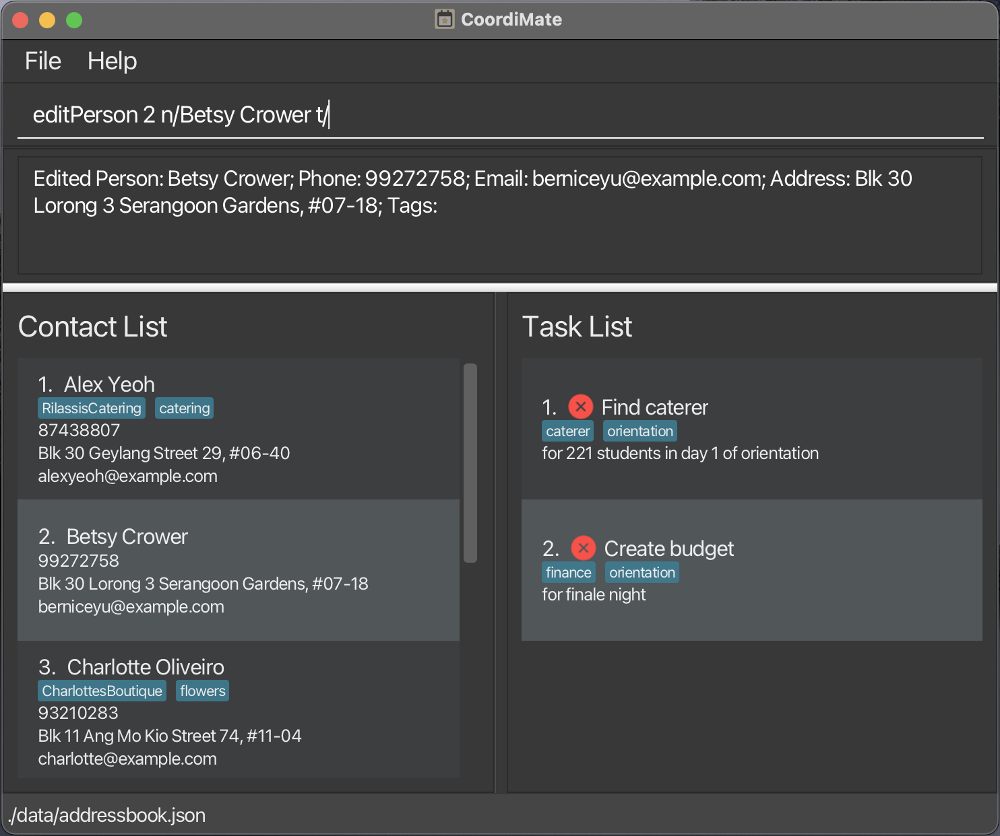

<h4>Potential Errors:</h4>

- `editPerson`
  - Negative example as no index or field is specified.<br><br>

  <br><br>

- `editPerson 1`
  - Negative example as no fields are specified.<br><br>

  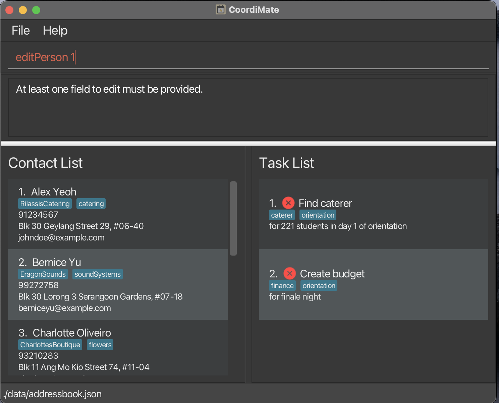<br><br>

- `editPerson 10 p/91234567 e/johndoe@example.com`
  - Negative example as invalid index provided.<br><br>

  

<div style="page-break-after: always;"></div>

#### 4. Finding a specific person: `findPerson`

Allows you to quickly find a specific person's details by their name.



<h4>Format:</h4>

```
findPerson KEYWORD [MORE_KEYWORDS]…
```

- At least one keyword is required to search.
- The search is case-insensitive. e.g `hans` will match `Hans`.
- The order of the keywords does not matter. e.g. `Hans Bo` will match `Bo Hans`.
- Only the **name** is searched.
- Only full words will be matched e.g. `Han` will not match `Hans`.
- Persons matching at least one keyword will be returned (i.e. `OR` search).
  - e.g. `Hans Bo` will match `Hans Gruber`, `Bo Yang`.

<h4>Examples:</h4>

- `findPerson alex yu`
  - Finds all persons whose names contains either `alex` or `yu`.<br><br>

  <br><br>

- `findPerson David`
  - No results are displayed as no person has a name that contains `David`.<br><br>

  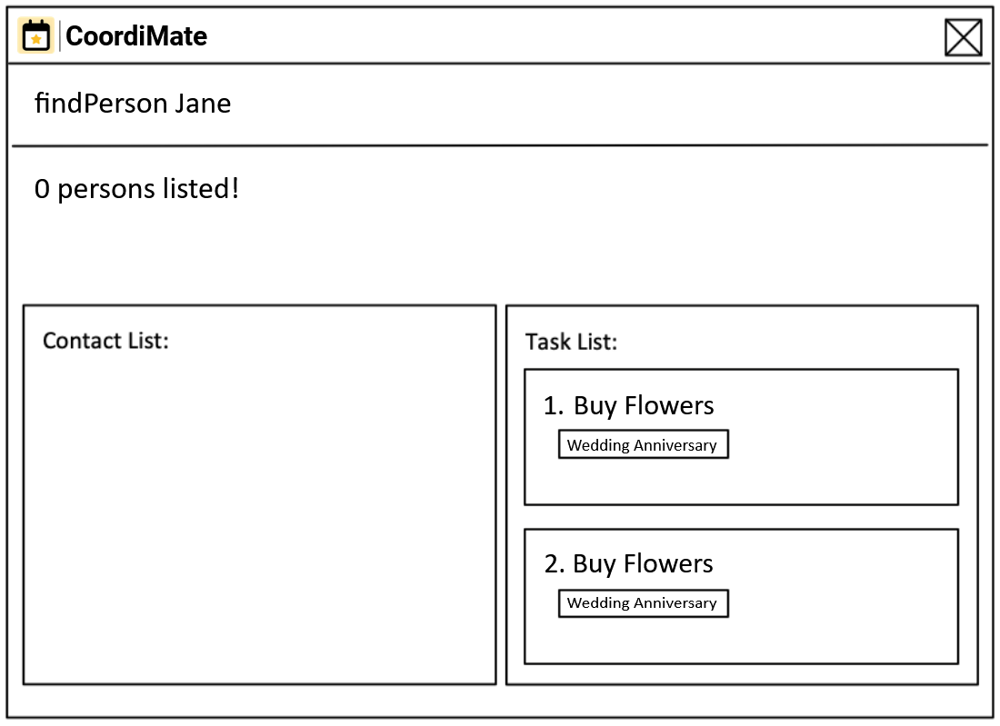

<h4>Potential Error:</h4>

- `findPerson`
  - Negative example as no keywords are specified.<br><br>

  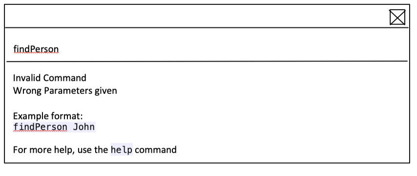

<div style="page-break-after: always;"></div>

#### 5. Deleting a person entry: `deletePerson`



Allows you to remove an outdated person from your contact list with ease.

<h4>Format:</h4>

```
deletePerson INDEX
```

- Deletes the person at the specified `INDEX`.
- The index refers to the index number shown in the displayed person list.
- The index **_must be a positive integer_** 1, 2, 3, …

<h4>Examples:</h4>

- `listPerson` followed by `deletePerson 2`
  - Deletes the 2nd person in your contact list.<br><br>

  <br><br>

- `findPerson Bernice` followed by `deletePerson 1`
  - Deletes the 1st person in the results of the `findPerson` command.<br><br>

  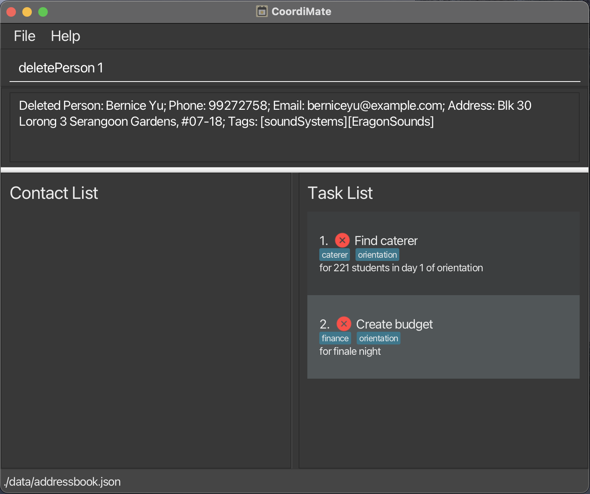

<h4>Potential Errors:</h4>

- `deletePerson`
  - Negative example as no index is specified.<br><br>

  <br><br>

- `deletePerson 1000`
  - Invalid index is provided.<br><br>

  

<div style="page-break-after: always;"></div>

#### 6. Clearing all person entries: `deleteAllPerson`

Clears all contacts in your contact list.



<h4>Format:</h4>

```
deleteAllPerson
```

<h4>Example:</h4>

- `deleteAllPerson`
  - Deletes all persons in your contact list.<br><br>

  

---

<div style="page-break-after: always;"></div>

### Commands to Manage Tasks

#### 7. Adding a task: `addTask`

Adds a task to your task list.

<h4>Format:</h4>

```
addTask T/TITLE n/NOTE [t/TAG]...
```

<h4>Examples:</h4>

- `addTask T/Book rooms n/For day 2 t/orientation t/bookings`
  - Adds a task titled `Book rooms` with note `For day 2` and tags `orientation` and `bookings`.<br><br>

  <br><br>

- `addTask T/Call Caterers n/For 292 people t/orientation`
  - Adds a task titled `Call Caterers` with note `For 292 people` and tag `orientation`.<br><br>

  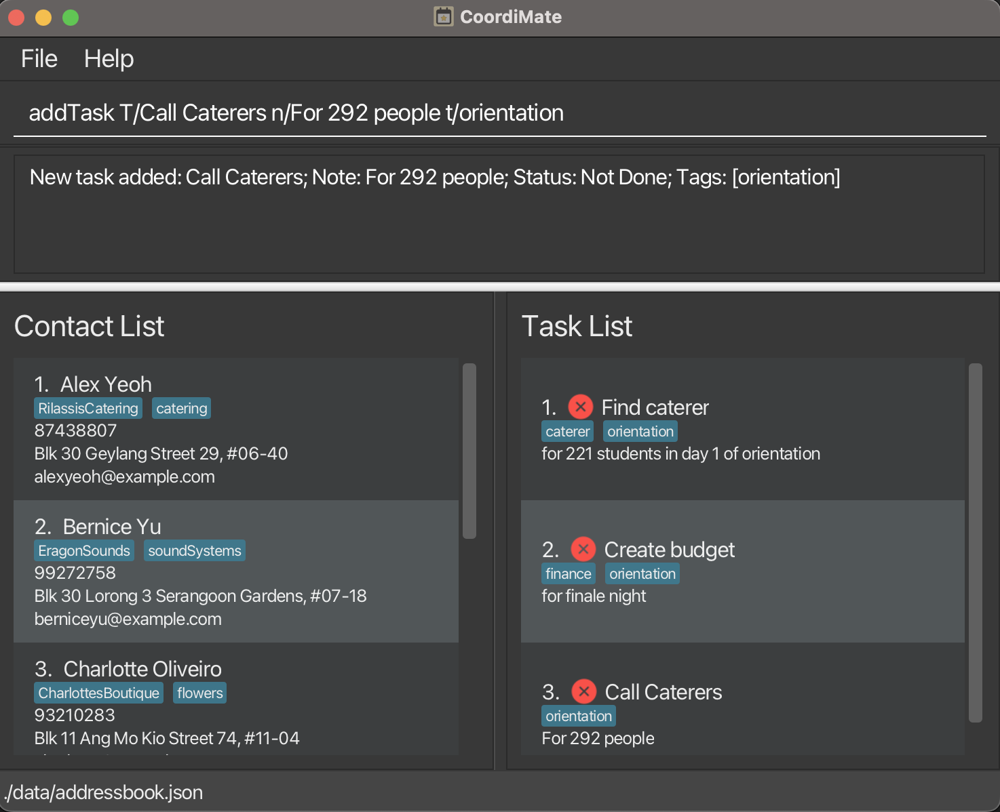

<h4>Potential Errors:</h4>

- `addTask T/Book rooms`
  - Negative example as the note is not specified.<br><br>

  

<div style="page-break-after: always;"></div>

#### 8. Listing all tasks: `listTask`

You can view details of all your tasks.

<h4>Format:</h4>

```
listTask
```

<h4>Examples:</h4>
- `listTask`
    - Displays a complete list of all tasks in your task list.<br><br>

  

<div style="page-break-after: always;"></div>

#### 9. Editing a task: `editTask`

You can edit the details of a task in your task list.

<h4>Format:</h4>

```
editTask INDEX [T/TITLE] [n/NOTE] [t/TAG]...
```

- Edits the task at the specified `INDEX`. The index refers to the index number shown in the task list currently displayed.
- Specify a new title with the `T/` prefix. This field is **optional**.
- Specify a new note with the `n/` prefix. This field is **optional**.
- Specify new tags with the `t/` prefix. This field is **optional**.
- At least one of the optional fields must be provided for the command to be valid.

<h4>Examples:</h4>

- `editTask 1 T/Find Caterer`
  - Edits the title of the 1st task to be `Find Caterer`.<br><br>

  <br><br>

- `editTask 2 T/Book room n/By Friday t/orientation`
  - Edits the title of the 2nd task to be `Book room`, the note to be `By Friday`, and the tag to be `orientation`.<br><br>

  

<h4>Potential Error:</h4>

- `editTask`
  - Negative example as the index is not specified.<br><br>

  

<div style="page-break-after: always;"></div>

#### 10. Finding a specific task: `findTask`

You can quickly locate tasks that contains your specified keywords in their title and/or note.



<h4>Format:</h4>

```
findTask KEYWORD [MORE_KEYWORDS]…
```

- At least one keyword is required to search.
- The search is case-insensitive. e.g `find` will match `Find`.
- The order of the keywords does not matter. e.g. `Find Venue` will match `Venue Find`.
- Both the **title and note** of a task are searched.
- Only full words will be matched e.g. `Venue` will not match `Venues`.
- Tasks matching at least one keyword in either the title or the note will be returned (i.e. `OR` search).
  - e.g. `Budget Venue` will match `Find Venue`, `Create Budget`.

<h4>Examples:</h4>

- `findTask Find Finale`
  - Finds tasks with titles or notes containing either `Find` or `Finale`.<br><br>

  <br><br>

- `findTask Photography`
  - No results are displayed as no task has a title or note that contains `Photography`.<br><br>

  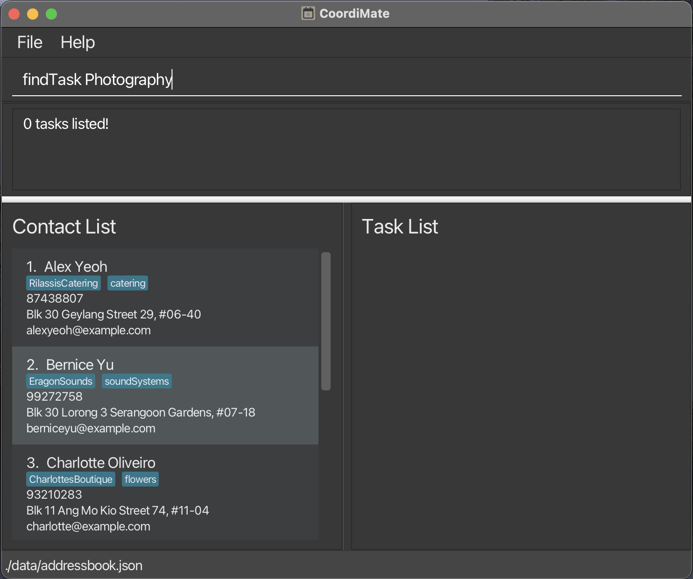

<h4>Potential Error:</h4>

- `findTask`
  - Negative example as no keywords are specified.<br><br>

  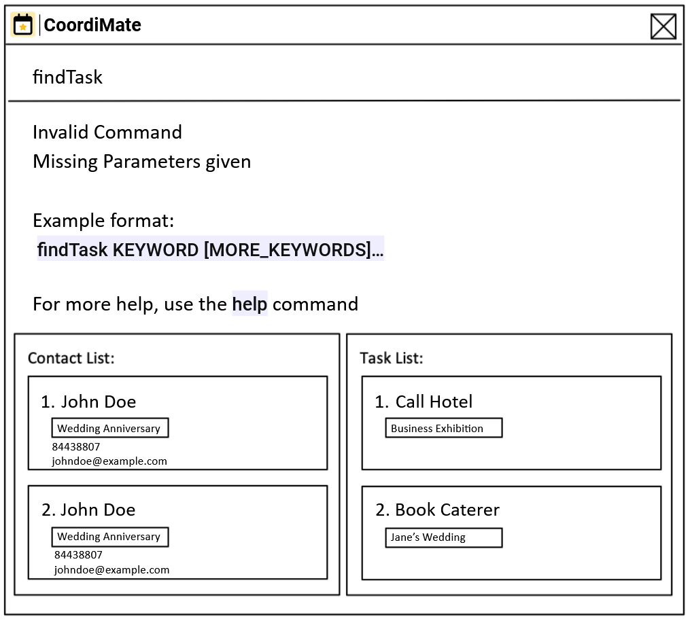

<div style="page-break-after: always;"></div>

#### 11. Deleting a task entry: `deleteTask`



Allows you to remove a task from your task list with ease.

<h4>Format:</h4>

`deleteTask INDEX`

- Deletes the task at the specified `INDEX`.
- The index refers to the index number shown in the task list currently displayed.

<h4>Examples:</h4>

- `listTask` followed by `deleteTask 2`
    - Deletes the 2nd task in your task list.<br><br>

  <br><br>

- `findTask caterer` followed by `deleteTask 1`
    - Deletes the 1st task in the results of the `findTask` command.<br><br>

  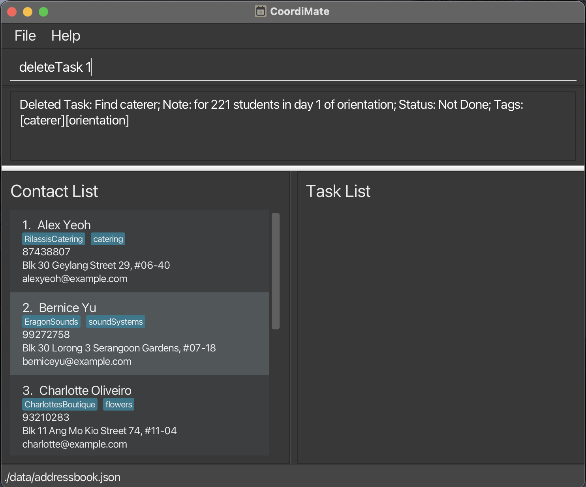

<h4>Potential Errors:</h4>

- `deleteTask`
    - Negative example as no index is specified.<br><br>

  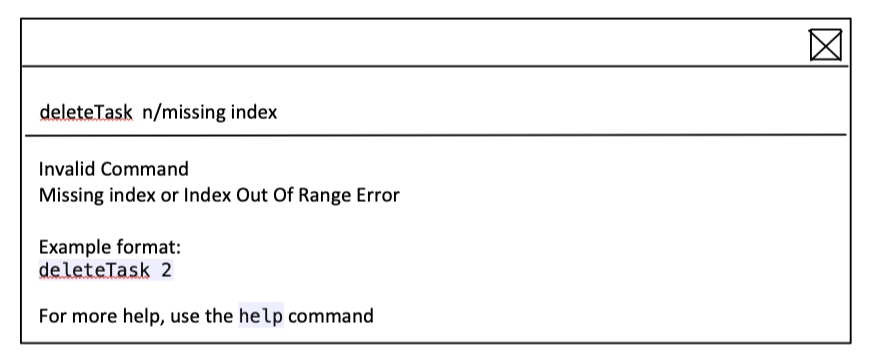<br><br>

- `deleteTask 1000`
    - Invalid index is provided.<br><br>

  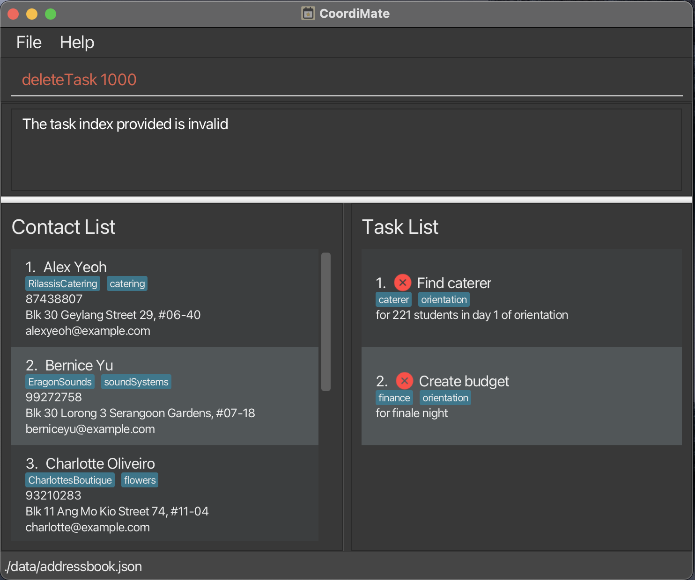

<div style="page-break-after: always;"></div>

#### 12. Clearing all task entries: `deleteAllTask`



Allows you to remove all entries from your task list.

<h4>Format:</h4>

```
deleteAllTask
```

<h4>Example:</h4>

- `deleteAllTask`
  - Deletes all tasks in your task list.<br><br>

  

<div style="page-break-after: always;"></div>

#### 13. Marking a task as done: `markTask`

Allows you to indicate that a specific task as **completed**.

<h4>Format:</h4>

```
markTask INDEX
```

- Marks the task at the specified `INDEX`.
- The index refers to the index number shown in the displayed task list.
- The index **_must be a positive integer_** 1, 2, 3, …



<h4>Examples:</h4>

- `listTask` followed by `markTask 1`
  - Marks the 1st task in the task list as **done**<br><br>

  <br><br>

- `findTask budget` followed by `markTask 1`
  - Marks the 1st task in the results of the `findTask` command as **done**<br><br>

  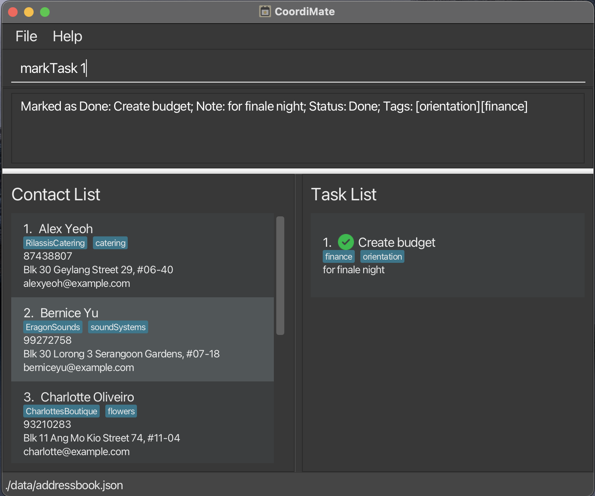

<h4>Potential Errors:</h4>
- `markTask`
  - Negative example as no index is given.<br><br>

  <br><br>

- `markTask 10`
  - Negative example as invalid index is given.<br><br>

  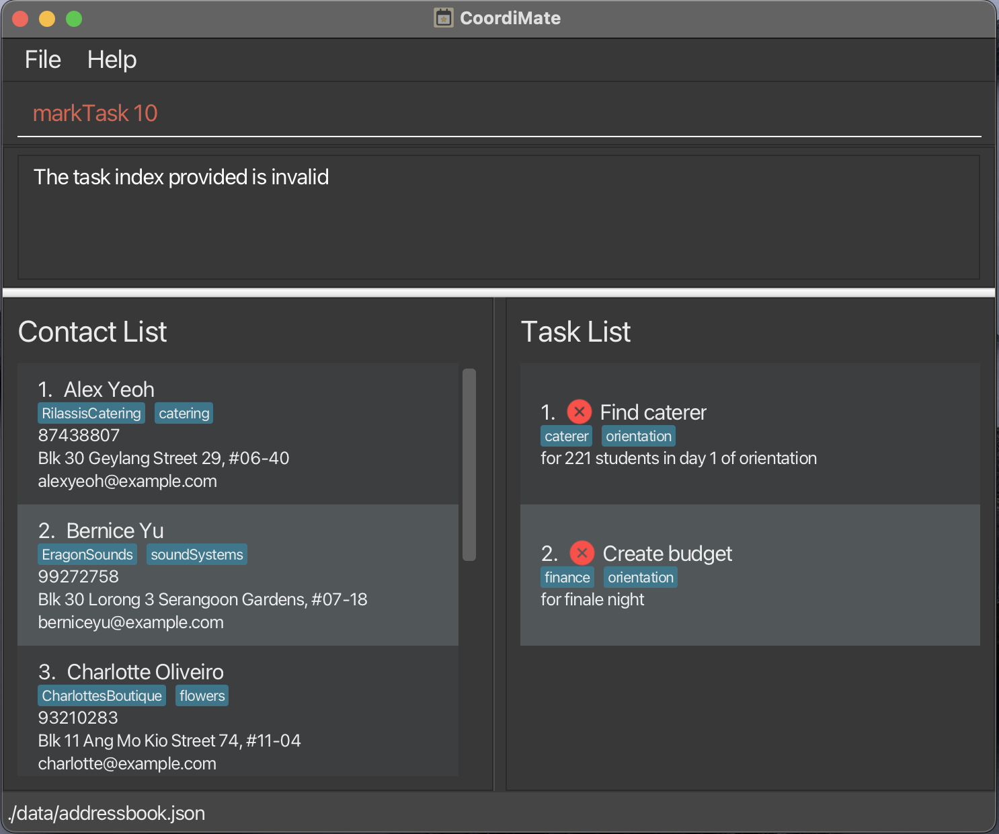

<div style="page-break-after: always;"></div>

#### 14. Marking a task as not done: `unmarkTask`

Allows you to indicate that a specific task as **not completed**.

<h4>Format:</h4>

```
unmarkTask INDEX
```

- Marks the task at the specified `INDEX`.
- The index refers to the index number shown in the displayed task list.
- The index **_must be a positive integer_** 1, 2, 3, …



<h4>Examples:</h4>

- `listTask` followed by `unmarkTask 1`
  - Marks the 1st task in the task list as **not done**<br><br>

  <br><br>

- `findTask budget` followed by `unmarkTask 1`
  - marks the 1st task in the results of the `findTask` command as **not done**<br><br>

  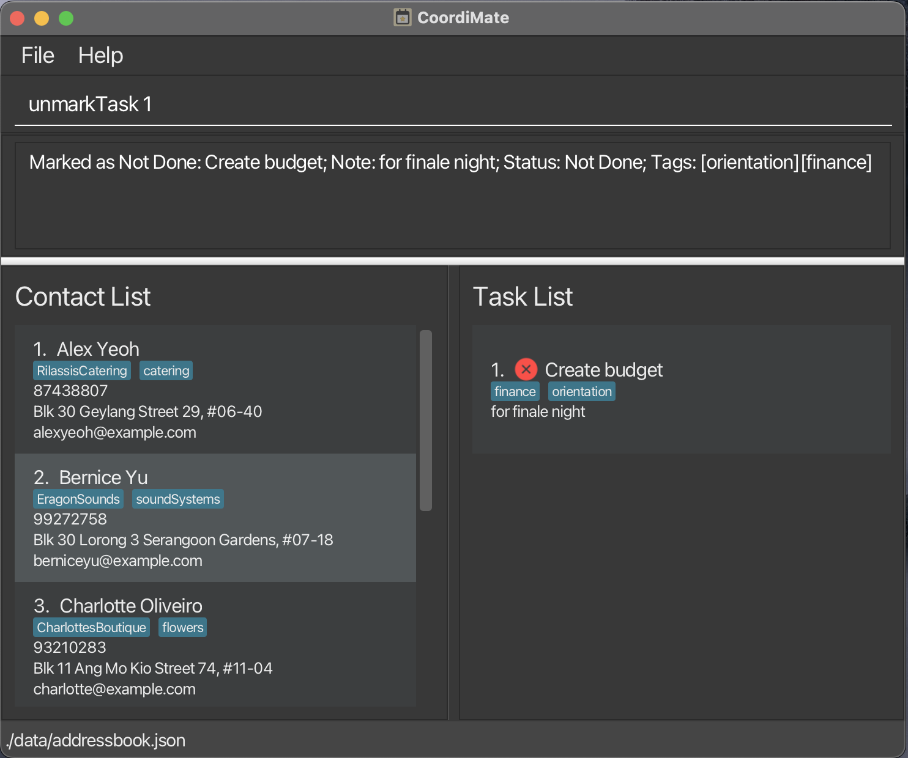

<h4>Potential Errors:</h4>

- `unmarkTask`
  - Negative example as no index is given.<br><br>

  <br><br>

- `unmarkTask 10`
  - Negative example as invalid index is given.<br><br>

  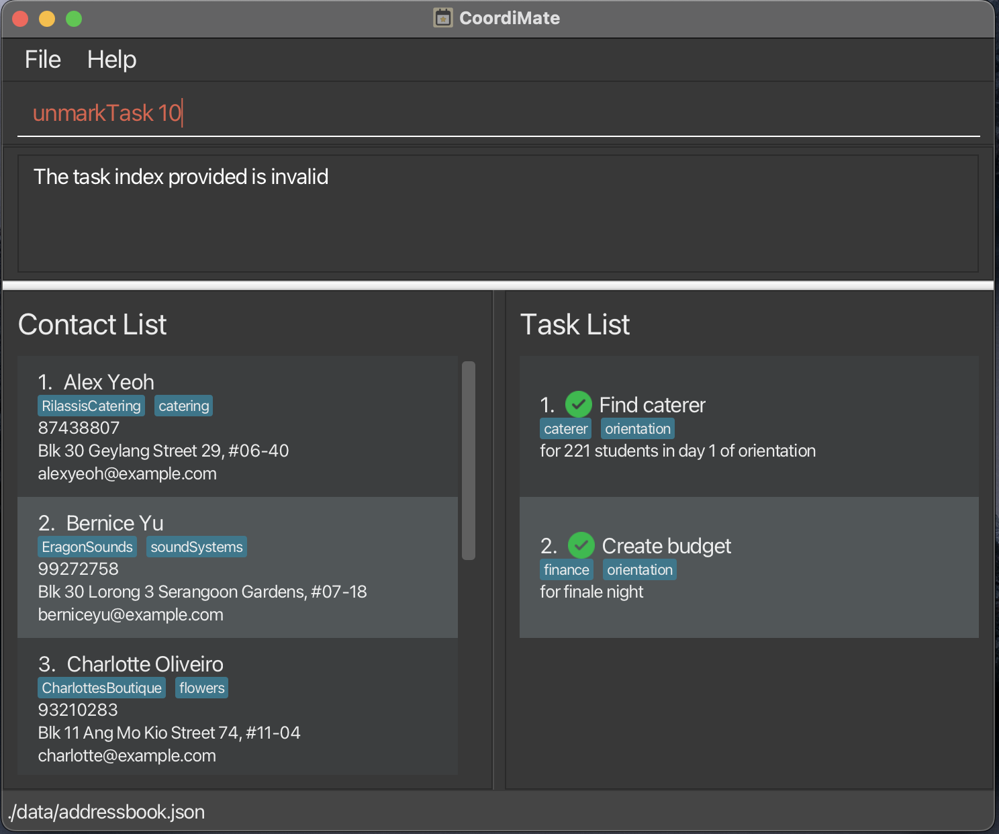

<div style="page-break-after: always;"></div>

#### 15. Finding all tasks that are done: `findDone`

You can filter the task list to find all the completed tasks, allowing you to review your accomplishments or track completed items with ease.



<h4>Format:</h4>

```
findDone
```

<h4>Examples:</h4>

- `findDone`
  - Tasks are displayed as they are marked as done.<br><br>

  <br><br>

- `findDone`
  - There are no tasks to be displayed, as no Task is done.<br><br>

  

<div style="page-break-after: always;"></div>

#### 16. Finding all tasks that are not done: `findNotDone`

You can filter the task list to find all the not completed tasks, allowing you to identify pending tasks, helping you focus on what needs to be done and prioritize your workflow effectively



<h4>Format:</h4>

```
findNotDone
```

<h4>Examples:</h4>

- `findNotDone`
  - Tasks are displayed as they are marked as not done.<br><br>

  <br><br>

- `findNotDone`
  - There are no tasks to be displayed, as no Task is not done.<br><br>

  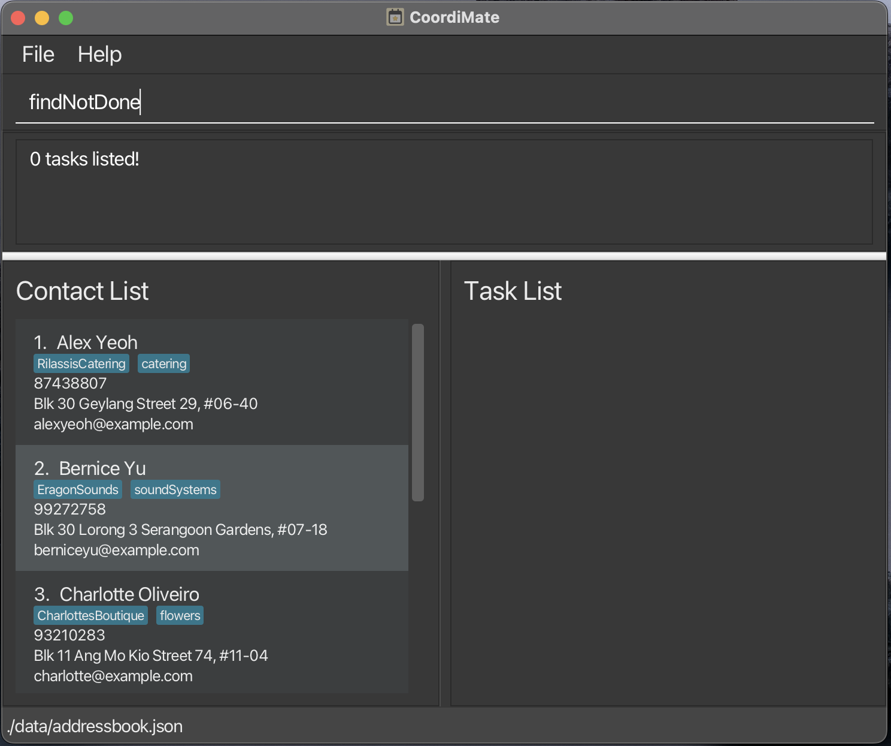

<div style="page-break-after: always;"></div>

#### 17. Deleting all tasks that are done: `deleteAllDone`

You can easily clean up your task list by deleting all completed task, allowing you maintain an organized and clutter-free task management system.



<h4>Format:</h4>

```
deleteAllDone
```

<h4>Examples:</h4>

- `deleteAllDone`
  - All tasks that are marked as done are deleted.<br><br>

  <br><br>

<h4>Potential Errors:</h4>

- `deleteAllDone`
  - There are no tasks found that are marked as done.<br><br>

  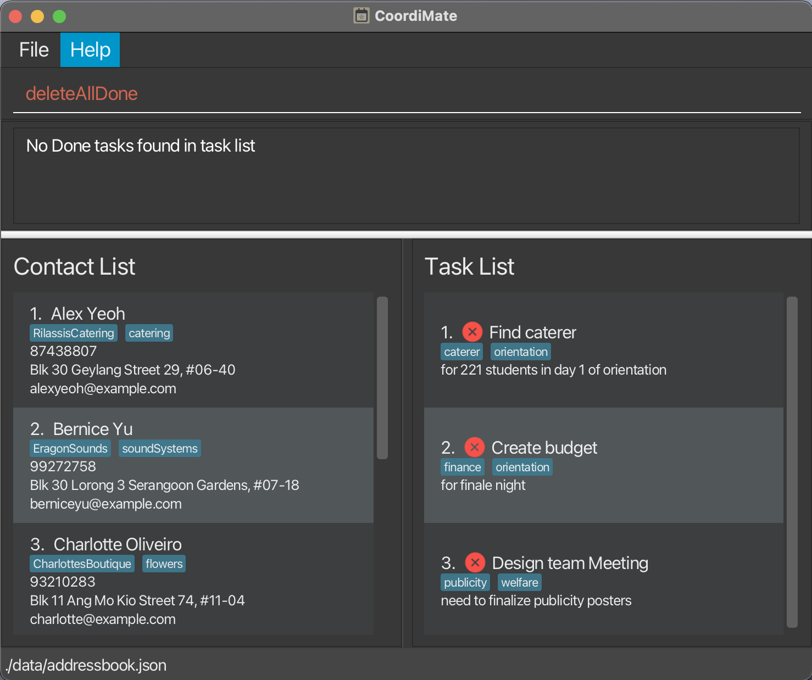<br><br>

---

<div style="page-break-after: always;"></div>

### Commands to Manage Tags

#### 18. Listing all tags: `listTag`

Provides you with a complete list of tags you have used in your contact list and task list, and the number of times each tag has been used.

The list is sorted by frequency of each tag in descending order.

If two tags have the same frequency, the tags are sorted in ASCII order.

{% include admonition.html type="note" title="About ASCII" body="

The American Standard Code for Information Interchange (ASCII) is a character encoding standard that is well understood by computers. <br>
In ASCII ordering, uppercase letters come before lowercase letters (<code>A</code> comes before <code>a</code>), unlike in alphabetical ordering where case does not matter. <br>
For more information, see <a href='https://en.wikipedia.org/wiki/ASCII' rel='noopener noreferrer' target='_blank'>ASCII</a> on Wikipedia.

" %}

<h4>Format:</h4>

```
listTag
```

<h4>Example:</h4>

- `listTag`
  - Shows you a list of all tags used in your contact list and task list and the number of times each tag has been used.<br><br>

  

<div style="page-break-after: always;"></div>

#### 19. Finding persons and tasks by tag: `findTag`

You can search for persons and tasks using tags.

<h4>Format:</h4>

```
findTag TAG [MORE_TAGS]...
```

- Finds the persons and tasks whose tags contain at least one of the specified `TAG`.
- Specify a tag with the `TAG` parameter. This field is **mandatory**.
- Specify more tags to expand your search scope with the `MORE_TAGS` parameter. This field is **optional**.

<h4>Examples:</h4>

- `findTag catering orientation`
  - Shows all persons and tasks with tags containing the words "catering" or "orientation".<br><br>

  <br><br>

- `findTag orientation`
  - Shows all persons and tasks with tags containing the word "orientation".<br><br>

  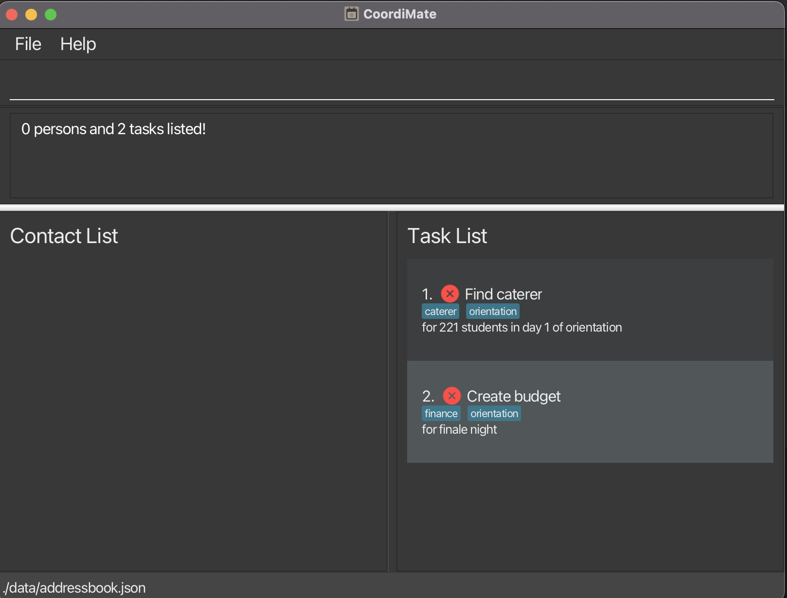

<h4>Potential Error:</h4>

- `findTag`
  - An invalid command format. The application expects one or more keywords after `findTag`.<br><br>

  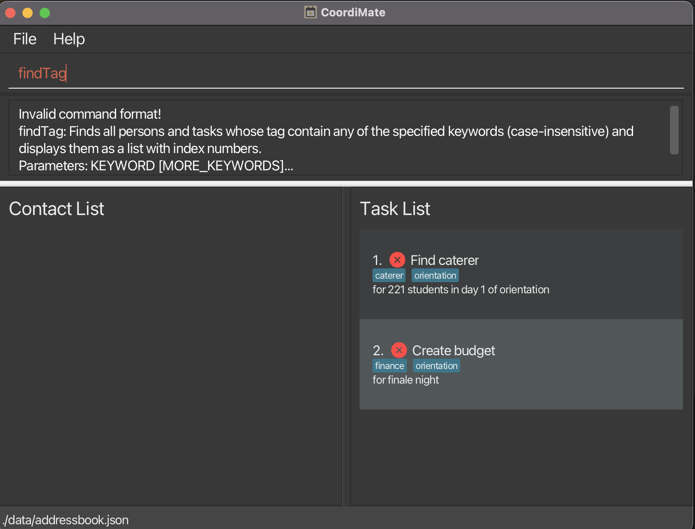

---

<div style="page-break-after: always;"></div>

### General Commands

#### 20. Viewing help: `help`

You can view a link to access the user guide at any time, ensuring that you will never be lost.

<h4>Format:</h4>

```
help
```

<h4>Example:</h4>

- `help`
  - Opens a window with a link to our user guide. You can copy the URL into a browser, or click on the "Open in browser" button to access the user guide directly.<br><br>

  

<div style="page-break-after: always;"></div>

#### 21. Listing all persons and tasks: `listAll`

You can list all persons and tasks in your contact list and task list at the same time.



<h4>Format:</h4>

```
listAll
```

<h4>Example:</h4>
- `listAll`
  - Shows all the persons and tasks in your contact list and task list.<br><br>

  



<div style="page-break-after: always;"></div>

#### 22. Exiting the program: `exit`

Once you are done with your work in CoordiMate, you can exit the program by typing a command.

<h4>Format:</h4>

```
exit
```

<h4>Example:</h4>
- `exit`
  - CoordiMate exits and the program window closes.

<br><br>

---

<div style="page-break-after: always;"></div>

## FAQ



<br><br>

---

<div style="page-break-after: always;"></div>

## Known Issues



<br><br>

---

<div style="page-break-after: always;"></div>

## Command Summary

### Managing Persons

 Action | Format | Example
--------|--------|---------
[**Add Person**](#1-adding-a-person-addperson)|`addPerson n/NAME p/PHONE_NUMBER e/EMAIL a/ADDRESS [t/TAG]…`|`addPerson n/John Doe p/98765432 e/johnd@example.com a/John street, block 123, #01-01`
[**List All Person**](#2-listing-all-persons-listperson) | `listPerson` | `listPerson`
[**Edit Person**](#3-editing-a-person-editperson) | `editPerson INDEX [n/NAME] [p/PHONE] [e/EMAIL] [a/ADDRESS] [t/TAG]…​` | `editPerson 1 p/91234567 e/johndoe@example.com`
[**Find Person**](#4-finding-a-specific-person-findperson) | `findPerson KEYWORD [MORE_KEYWORDS]…` | `findPerson John`
[**Delete Person**](#5-deleting-a-person-entry-deleteperson) | `deletePerson INDEX` | `deletePerson 1`
[**Delete All Person**](#6-clearing-all-person-entries-deleteallperson) | `deleteAllPerson` | `deleteAllPerson`

### Managing Tasks

 Action | Format | Example
--------|--------|---------
[**Add Task**](#7-adding-a-task-addtask) | `addTask t/TITLE n/NOTE` | `addTask t/Get Flowers n/Wedding Anniversary`
[**List All Task**](#8-listing-all-tasks-listtask) | `listTask` | `listTask`
[**Edit Task**](#9-editing-a-task-edittask) | `editTask INDEX [t/TITLE] [n/NOTE]` | `editTask 1 t/Call Caterer`
[**Find Task**](#10-finding-a-specific-task-findtask) | `findTask KEYWORD [MORE_KEYWORDS]…` | `findTask Call Wedding`
[**Delete Task**](#11-deleting-a-task-entry-deletetask) | `deleteTask INDEX` | `deleteTask 1`
[**Delete All Task**](#12-clearing-all-task-entries-deletealltask) | `deleteAllTask` | `deleteAllTask`
[**Mark Task**](#13-marking-a-task-as-done-marktask) | `markTask INDEX` | `markTask 1`
[**Unmark Task**](#14-marking-a-task-as-not-done-unmarktask) | `unmarkTask INDEX` | `unmarkTask 1`
[**Find Done Task**](#15-finding-all-tasks-that-are-done-finddone) | `findDone` | `findDone`
[**Find Not Done Task**](#16-finding-all-tasks-that-are-not-done-findnotdone) | `findNotDone` | `findNotDone`
[**Delete All Done Task**](#17-deleting-all-tasks-that-are-done-deletealldone) | `deleteAllDone` | `deleteAllDone`

### Managing Tags

 Action | Format | Example
--------|--------|---------
[**List All Tags**](#18-listing-all-tags-listtag) | `listTag` | `listTag`
[**Find Tags**](#19-finding-persons-and-tasks-by-tag-findtag) | `indTag TAG [MORE_TAGS]...` | `findTag orientation`

### General

 Action | Format | Example
--------|--------|---------
[**View Help**](#20-viewing-help-help) | `help` | `help`
[**List All Person and Task**](#21-listing-all-persons-and-tasks-listall) | `listAll` | `listAll`
[**Exit**](#22-exiting-the-program-exit) | `exit` | `exit`
