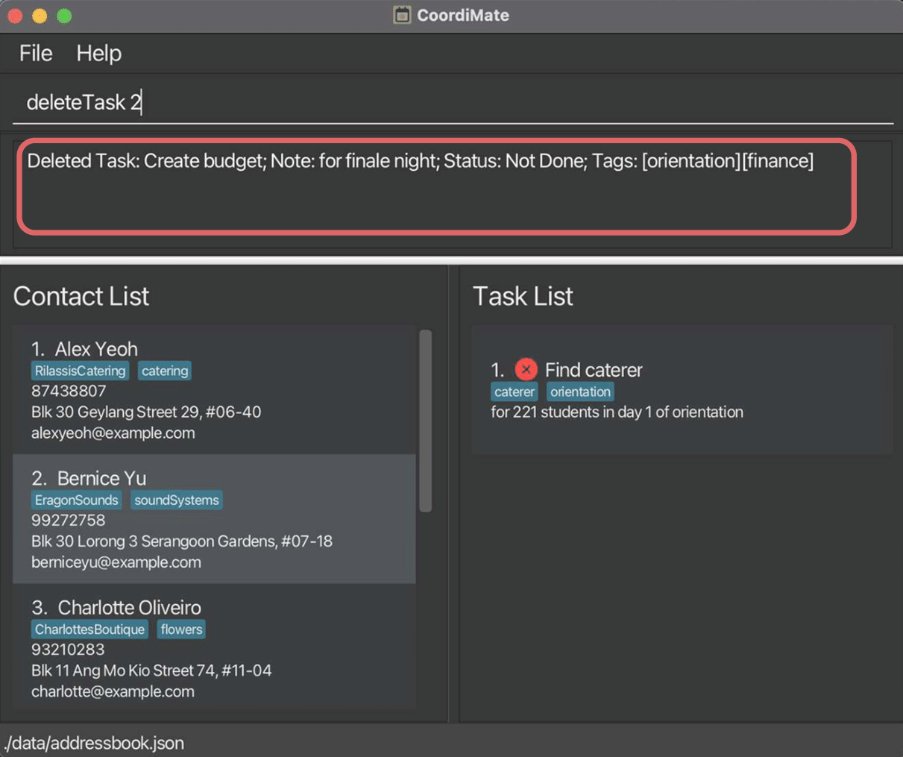

<!-- Inject styles for custom table widths -->

<style>
.field-table th:nth-child(1) {
    width: 15%;
}

.field-table th:nth-child(2) {
    width: 15%;
}

.field-table th:nth-child(3) {
    width: 10%;
}

.field-table th:nth-child(4) {
    width: 60%;
}

.errors-table th:nth-child(1) {
    width: 50%;
}

.errors-table th:nth-child(2) {
    width: 50%;
}
</style>

Are you a School of Computing (SoC) Computing Club event planner juggling numerous tasks and contacts for your upcoming events?

Managing everything efficiently just got easier with CoordiMate!

CoordiMate is your go-to **desktop app** designed specifically for **SoC Computing Club event planners** to help you **manage your contacts and tasks** for your events, so that you can focus on the event itself.

And here's the best part – while it's perfect for members of SoC Computing Club, **event planners of all kinds** can benefit from CoordiMate's powerful features too!

<h4>Why choose CoordiMate?</h4>

1. **User-Friendly Command Line Interface (CLI)**: CoordiMate is optimized for use via a CLI, combining all the benefits of a Graphical User Interface (GUI) with the efficiency of a CLI.

2. **Speedy Navigation**: If you're a fast typist, CoordiMate will help you complete your contact and tasks management faster than traditional GUI apps, maximising your productivity.

Don't let the stress of contact and task management hinder your event planning creativity.

Let **CoordiMate** take care of the details, while you craft extraordinary events with confidence.

## Using This Guide

This document will guide you on the various features of CoordiMate and how to use them.

If you are a new user, we recommend that you read this guide starting from the [Quick Start](#quick-start) section.

If you are an experienced user, you can use the [Table of Contents](#table-of-contents) below to quickly locate the relevant section. Alternatively, you can jump to the [Command Summary](#command-summary) section for an overview of the command syntax.

Here are some annotations used in this guide:









Throughout this guide, you will see different text styles that are used to highlight important information.

- <a href="javascript: void(0)">Text in blue</a> are links which you can click on to jump to the relevant section.
- `Text with light blue background` are commands or file names which are used for CoordiMate.

---

<div style="page-break-after: always;"></div>

## Table of Contents

- Table of Contents
{:toc}

---

<div style="page-break-after: always;"></div>

## Features

[Back to Table of Contents](#table-of-contents)

1. **Easy Management of People**:

  - Seamlessly create, update, and delete your contacts, ensuring your contact list is always up-to-date.

2. **Effortless Task Management**:

  - CoordiMate records down your tasks and their completion status, allowing you to stay on top of your to-do list.

3. **Simplified Searching**:

  - Easily locate contacts or tasks based on your criteria. No more scrolling through endless lists!

4. **Hassle-Free Data Management**:

  - CoordiMate automatically saves your data on every change, so you never have to worry about losing your data.
  - When CoordiMate starts, your existing data is automatically loaded in, allowing you to pick up where you left off.
  - For advanced users, CoordiMate offers you complete data control by saving your data in a human-readable format. Locate the data file at `[JAR file location]/data/addressbook.json` to edit CoordiMate's data directly!



---

<div style="page-break-after: always;"></div>

## Quick Start

[Back to Table of Contents](#table-of-contents)

1. Ensure you have Java `11` or above installed in your computer.

2. Download the latest `CoordiMate.jar` from [here](https://github.com/AY2324S1-CS2103T-T10-2/tp/releases).

3. Copy `CoordiMate.jar` to the folder you want to use as the _home folder_ for CoordiMate. This folder will be used by CoordiMate to store its data.

4. Open a command terminal, `cd` into the folder you put `CoordiMate.jar` in, and use the `java -jar CoordiMate.jar` command to start CoordiMate.<br>

   A GUI similar to the below screenshot should appear in a few seconds. Note how the app contains some sample data.<br><br>
   

5. Type the command in the command box and press Enter to execute it. e.g. typing `help` and pressing Enter will open the help window.<br><br>

   Some example commands you can try:

   - `listPerson` : Lists all persons.

   - `addPerson n/John Doe p/98765432 e/johnd@example.com a/John street, block 123, #01-01` : Adds a new contact named `John Doe` with the specified details.

   - `deletePerson 3` : Deletes the 3rd contact shown in the current contact list.

   - `findTask caterer` : Finds all tasks with the word `caterer` in their title or note.

   - `listTask` : Lists all tasks.

   - `addTask T/Get Flowers n/for Finale Night` : Adds a task titled `Get Flowers` with note `for Finale Night` to the task list.

   - `markTask 1` : Marks the 1st task shown in the current task list as done.

   - `exit` : Exits the app.

6. Refer to the [Usage](#usage) section below for details of each command.

---

<div style="page-break-after: always;"></div>

## Usage

[Back to Table of Contents](#table-of-contents)

The commands are split into 4 main sections:

1. [Commands to Manage Persons](#1-commands-to-manage-persons)
2. [Commands to Manage Tasks](#2-commands-to-manage-tasks)
3. [Commands to Manage Tags](#3-commands-to-manage-tags)
4. [General commands](#4-general-commands)

{% include admonition.html type="note" title="Note" body="

<ul>
  <li>
    <p>
      Words in <code>UPPER_CASE</code> are the fields to be supplied by the user.<br>
      e.g. in <code>addPerson n/NAME</code>, <code>NAME</code> is a field which can be used as <code>addPerson n/John Doe</code>, where <code>John Doe</code> is the value of the field <code>NAME</code>. <br>
    </p>
  </li>

  <li>
    <p>
      Fields in square brackets are optional.<br>
      e.g <code>n/NAME [t/TAG]</code> can be used as <code>n/John Doe t/friend</code> or as <code>n/John Doe</code>.<br>
      Note that the square brackets (<code>[</code> and <code>]</code>) are not part of the syntax.
    </p>
  </li>

  <li>
    <p>
      Fields in square brackets with <code>…</code> after them can be used multiple times, including zero times.<br>
      e.g. <code>[t/TAG]…​</code> can be used as <code> </code> (i.e. 0 times), <code>t/friend</code>, <code>t/friend t/family</code> etc.
    </p>
  </li>

  <li>
    <p>
      Fields can be in any order.<br>
      e.g. if the command specifies <code>n/NAME p/PHONE_NUMBER</code>, <code>p/PHONE_NUMBER n/NAME</code> is also acceptable.
    </p>
  </li>

  <li>
    <p>
      Extraneous fields for commands that do not take in fields (such as <code>help</code>, <code>listPerson</code>, <code>deleteAllPerson</code>, <code>listTask</code>, <code>deleteAllTask</code> and <code>exit</code>) will be ignored.<br>
      e.g. if the command specifies <code>help 123</code>, it will be interpreted as <code>help</code>.
    </p>
  </li>
</ul>

" %}



<div style="page-break-after: always;"></div>

### Command Aliases

[Back to Table of Contents](#table-of-contents)

CoordiMate supports predefined aliases for commands, so that you can get things done faster!<br>

**Example 1: Adding a person**

Instead of typing:

<div class="highlight">
  <pre class="highlight"><code><b>addPerson</b> n/John Doe p/12345678 e/john@example.com a/1 John Street t/friend</code></pre>
</div>

you can simply type:

<div class="highlight">
  <pre class="highlight"><code><b>ap</b> n/John Doe p/12345678 e/john@example.com a/1 John Street t/friend</code></pre>
</div>

Both commands will add a person named `John Doe` with phone number `12345678`, email `john@example.com`, address `1 John Street`, and tag `friend` to your contact list.<br><br>

<br>

**Example 2: Listing all persons**

Instead of typing:

<div class="highlight">
  <pre class="highlight"><code><b>listPerson</b></code></pre>
</div>

you can simply type:

<div class="highlight">
  <pre class="highlight"><code><b>lp</b></code></pre>
</div>

Both commands will show a full list of all the contacts in your contact list.

<br>

A summary of valid aliases is shown in the [Command Summary](#command-summary) section below.

---

<div style="page-break-after: always;"></div>

### Understanding Our GUI

[Back to Table of Contents](#table-of-contents)


1. Menu Bar: Quick access to File and Help features.
2. Command Line: Type your commands here.
3. Command Result: View command results or error messages through here.
4. Contact List: View and manage contacts here.
5. Task List: View and manage tasks here.
6. Data Storage: Displays the path where your data is stored.



---

<div style="page-break-after: always;"></div>

### 1. Commands to Manage Persons

#### 1.1. Adding a person: `addPerson`

[Back to Table of Contents](#table-of-contents)

You can add new persons to your contact list, so that you can remember details of new people you meet.

<h4>Format:</h4>

```
addPerson n/NAME p/PHONE_NUMBER e/EMAIL a/ADDRESS [t/TAG]…
```

<h4>Alias:</h4>

```
ap
```

<h4>Fields:</h4>

| Fields | Prefix | Required | Remarks |
|--------|--------|----------|---------|
| `NAME` | `n/` | Yes | Full name of the individual.|
| `PHONE_NUMBER` | `p/` | Yes | Phone number of the individual.|
| `EMAIL` | `e/` | Yes | Email address of the individual.|
| `ADDRESS` | `a/` | Yes | Physical address of the individual.|
| `TAG` | `t/` | No | Tag(s) for the individual.|
{: .field-table}

- A person is uniquely identified by their `NAME`. This field is case sensitive.

<h4>Example:</h4>

- `addPerson n/Charlotte Oliveiro p/93210283 e/charlotteo@example.com a/Blk 11 Ang Mo Kio Street 74, #11-04 t/flowers`<br><br>
  

  *<center>CoordiMate adds a new contact with the corresponding details.</center>*

<h4>Potential Errors:</h4>

 Error message | How to resolve
---------------|---------------
`Invalid command format!…` | Ensure that the name, phone number, email address and address are specified.
`Names should only contain alphanumeric characters and spaces, and it should not be blank` | Ensure that the name specified is not blank and contain only alphanumeric characters. Whitespaces at the start and end are trimmed.
`Phone numbers should only contain numbers, and it should be at least 3 digits long` | Ensure that the phone number specified is not blank, contain only numbers and at least 3 digits long. Whitespaces at the start and end are trimmed.
`Addresses can take any values, and it should not be blank` | Ensure that the address specified is not blank. Whitespaces at the start and end are trimmed.
`Emails should be of the format local-part@domain and adhere to the following constraints: …` | Ensure that the email specified is not blank and adheres to the constraints specified. Whitespaces at the start and end are trimmed.
`This person already exists in the address book.` | Ensure that the new name specified do not match an existing person.
`Multiple values specified for the following single-valued field(s): n/ e/ a/ p/` | Ensure that there are no duplicate fields for name, email, address and phone number.

<div style="page-break-after: always;"></div>

#### 1.2. Listing all persons: `listPerson`

[Back to Table of Contents](#table-of-contents)

You can view your entire contact list so that you can quickly access and manage your connections.

<h4>Format:</h4>

```
listPerson
```

<h4>Alias:</h4>

```
lp
```

<h4>Example:</h4>

- `listPerson`<br><br>
  

  *<center>CoordiMate shows you the full contact list.</center>*


<div style="page-break-after: always;"></div>

#### 1.3. Editing a person: `editPerson`

[Back to Table of Contents](#table-of-contents)

Enables you to change the details or particulars of an existing contact in your contact list.

<h4>Format:</h4>

```
editPerson INDEX [n/NAME] [p/PHONE] [e/EMAIL] [a/ADDRESS] [t/TAG]…
```

<h4>Alias:</h4>

```
ep
```

- Edits the person at the specified `INDEX`. The index refers to the index number shown in the displayed person list. This field is **mandatory**.
  - The index **_must be a positive integer_** 1, 2, 3, … , 2147483647.
- Existing values will be updated to the input values.
- Specify a new name with the `n/` prefix. This field is **optional**.
- Specify a new phone number with the `p/` prefix. This field is **optional**.
- Specify a new email with the `e/` prefix. This field is **optional**.
- Specify a new address with the `a/` prefix. This field is **optional**.
- Specify new tags with the `t/` prefix. This field is **optional**.
  - You may add multiple tags to a person by specifying the `t/` prefix multiple times.
  - Note that this will replace all existing tags of the task. If you wish to add to the existing tags of the task, use the [`addTagPerson` command](#31-adding-tags-to-a-person-addtagperson) instead.
  - Specifying `t/` without any tags will clear all existing tags of the task.
- At least one of the optional fields must be provided for the command to be valid.

<h4>Example:</h4>

- `editPerson 1 p/91234567 e/johndoe@example.com`
  - Edits the phone number and email address of the 1st person to be `91234567` and `johndoe@example.com` respectively.<br><br>

  <br><br>

<h4>Potential Errors:</h4>

 Error message | How to resolve
---------------|---------------
`Invalid command format!…` | Ensure that the index is correctly specified as an integer.
`At least one field to edit must be provided.` | Ensure that at least one of name, phone, email, address or tag is specified.
`The person index provided is invalid` | Ensure that the index provided is within the valid range.
`Names should only contain alphanumeric characters and spaces, and it should not be blank` | Ensure that the name specified is not blank and contain only alphanumeric characters. Whitespaces at the start and end are trimmed.
`Phone numbers should only contain numbers, and it should be at least 3 digits long` | Ensure that the phone number specified is not blank, contain only numbers and at least 3 digits long. Whitespaces at the start and end are trimmed.
`Addresses can take any values, and it should not be blank` | Ensure that the address specified is not blank. Whitespaces at the start and end are trimmed.
`Emails should be of the format local-part@domain and adhere to the following constraints: …` | Ensure that the email specified is not blank and adheres to the constraints specified. Whitespaces at the start and end are trimmed.
`This person already exists in the address book.` | Ensure that the new name specified do not match an existing person.

<div style="page-break-after: always;"></div>

#### 1.4. Finding a specific person: `findPerson`

[Back to Table of Contents](#table-of-contents)

You can find a person by their name, so that you can quickly locate their contact details.

<h4>Format:</h4>

```
findPerson KEYWORD [MORE_KEYWORDS]…
```

<h4>Alias:</h4>

```
fp
```

<h4>Fields:</h4>

| Fields | Prefix | Required | Remarks |
|--------|--------|----------|---------|
| `KEYWORD` | No Prefix | Yes | The keyword to search for.|
{: .field-table}

- Persons matching at least one `KEYWORD` in their names will be shown. This field is case insensitive and the order of keywords does not matter.



<h4>Example:</h4>

- `findPerson alex yu`<br><br>
  

  *<center>CoordiMate finds all persons whose names contains either <code>alex</code> or <code>yu</code>.</center>*

<h4>Potential Error:</h4>

 Error message | How to resolve
---------------|---------------
`Invalid command format!…` | Ensure that a keyword is provided.
{: .errors-table}

<div style="page-break-after: always;"></div>

#### 1.5. Deleting a person entry: `deletePerson`

[Back to Table of Contents](#table-of-contents)

You can remove a person from your contact list so that you can remove contacts that you no longer need.

<h4>Format:</h4>

```
deletePerson INDEX
```

<h4>Alias:</h4>

```
dp
```

<h4>Fields:</h4>

| Fields  | Prefix | Required                                           | Remarks                                                                                                                         |
|---------|--------|----------------------------------------------------|---------------------------------------------------------------------------------------------------------------------------------|
| `INDEX` | No Prefix |  | The person at this index in the displayed person list is deleted. The index must be a positive integer 1, 2, 3, … , 2147483647. |
{: .field-table}



<h4>Example:</h4>

- `listPerson` followed by `deletePerson 2`.<br><br>
  

  *<center>CoordiMate deletes the person at the index <code>2</code>, displayed after a `listPerson` command.</center>*

<h4>Potential Errors:</h4>

 Error message | How to resolve
---------------|---------------
`Invalid command format!…` | Ensure that the index is correctly specified as an integer.
`The person index provided is invalid` | Ensure that the index provided is within the valid range.

<div style="page-break-after: always;"></div>

#### 1.6. Clearing all person entries: `deleteAllPerson`

[Back to Table of Contents](#table-of-contents)

Clears **all** contacts in your contact list.



<h4>Format:</h4>

```
deleteAllPerson
```

<h4>Alias:</h4>

```
dap
```

<h4>Example:</h4>

- `deleteAllPerson`
  - Deletes all persons in your contact list.<br><br>

  

---

<div style="page-break-after: always;"></div>

### 2. Commands to Manage Tasks

#### 2.1. Adding a task: `addTask`

[Back to Table of Contents](#table-of-contents)

Adds a task to your task list.

<h4>Format:</h4>

```
addTask T/TITLE n/NOTE [t/TAG]…
```

<h4>Alias:</h4>

```
at
```

- Provide the title of the task using the `T/` prefix. This field is **mandatory**.
- Provide the note of the task using the `n/` prefix. This field is **mandatory**.
- Tag the task using the `t/` prefix. This field is **optional**.
- You may add multiple tags to a task by specifying the `t/` prefix multiple times.
- A task is identified by the combination of its title and note. This means that you cannot have two tasks with the same title and note.

<h4></h4>

<h4>Example:</h4>

- `addTask T/Book rooms n/For day 2 t/orientation t/bookings`
  - Adds a task titled `Book rooms` with note `For day 2` and tags `orientation` and `bookings`.<br><br>

  <br><br>

<h4>Potential Errors:</h4>

 Error message | How to resolve
---------------|---------------
`Invalid command format!…` | Ensure that the title and note are specified.
`Titles/Notes can take any value, as long as it is not blank and does not start with a whitespace` | Ensure that the title and note specified are not blank. Whitespaces at the start and end are trimmed.

<div style="page-break-after: always;"></div>

#### 2.2. Listing all tasks: `listTask`

[Back to Table of Contents](#table-of-contents)

You can view your entire task list so that you can stay organized and on top of your responsibilities.

<h4>Format:</h4>

```
listTask
```

<h4>Alias:</h4>

```
lt
```

<h4>Example:</h4>

- `listTask`<br><br>
  

  *<center>CoordiMate shows you the full task list.</center>*

<div style="page-break-after: always;"></div>

#### 2.3. Editing a task: `editTask`

[Back to Table of Contents](#table-of-contents)

You can edit the details of a task in your task list.

<h4>Format:</h4>

```
editTask INDEX [T/TITLE] [n/NOTE] [t/TAG]…
```

<h4>Alias:</h4>

```
et
```

- Edits the task at the specified `INDEX`. The index refers to the index number shown in the task list currently displayed. This field is **mandatory**.
  - The index **_must be a positive integer_** 1, 2, 3, … , 2147483647.
- Existing values will be updated to the input values.
- Specify a new title with the `T/` prefix. This field is **optional**.
- Specify a new note with the `n/` prefix. This field is **optional**.
- Specify new tags with the `t/` prefix. This field is **optional**.
  - You may add multiple tags to a task by specifying the `t/` prefix multiple times.
  - Note that this will replace all existing tags of the task. If you wish to add to the existing tags of the task, use the [`addTagTask` command](#32-adding-tags-to-a-task-addtagtask) instead.
  - Specifying `t/` without any tags will clear all existing tags of the task.
- At least one of the optional fields must be provided for the command to be valid.

<h4>Example:</h4>

- `editTask 2 T/Book room n/By Friday t/orientation`
  - Edits the title of the 2nd task to be `Book room`, the note to be `By Friday`, and the tag to be `orientation`.<br><br>

  

<h4>Potential Errors:</h4>

 Error message | How to resolve
---------------|---------------
`Invalid command format!…` | Ensure that the index is correctly specified as an integer.
`At least one field to edit must be provided.` | Ensure that at least one of title, note, or tag is specified.
`Titles/Notes can take any value, as long as it is not blank and does not start with a whitespace` | Ensure that the title and/or note specified are not blank. Whitespaces at the start and end are trimmed.
`This task already exists in the address book.` | Ensure that the new title and note specified do not match an existing task.

<div style="page-break-after: always;"></div>

#### 2.4. Finding a specific task: `findTask`

[Back to Table of Contents](#table-of-contents)

You can quickly locate tasks that contains your specified keywords in their title and/or note.



<h4>Format:</h4>

```
findTask KEYWORD [MORE_KEYWORDS]…
```

<h4>Alias:</h4>

```
ft
```

- At least one keyword is required to search.
- The search is case-insensitive. e.g `find` will match `Find`.
- The order of the keywords does not matter. e.g. `Find Venue` will match `Venue Find`.
- Both the **title and note** of a task are searched.
- Only full words will be matched e.g. `Venue` will not match `Venues`.
- Tasks matching at least one keyword in either the title or the note will be returned (i.e. `OR` search).
  - e.g. `Budget Venue` will match `Find Venue`, `Create Budget`.

<h4>Example:</h4>

- `findTask Find Finale`
  - Finds tasks with titles or notes containing either `Find` or `Finale`.<br><br>

  <br><br>

<h4>Potential Error:</h4>

 Error message | How to resolve
---------------|---------------
`Invalid command format!…` | Ensure that a keyword is provided.

<div style="page-break-after: always;"></div>

#### 2.5 Deleting a task entry: `deleteTask`

[Back to Table of Contents](#table-of-contents)

You can remove a task from your task list so that you can remove tasks that you no longer need.

<h4>Format:</h4>

```
deleteTask INDEX
```

<h4>Alias:</h4>

```
dt
```

- Deletes the task at the specified `INDEX`.
- The index refers to the index number shown in the task list currently displayed.
- The index **_must be a positive integer_** 1, 2, 3, … , 2147483647.

<h4>Fields:</h4>

| Fields  | Prefix | Required                                           | Remarks                                                                                                                     |
|---------|--------|----------------------------------------------------|-----------------------------------------------------------------------------------------------------------------------------|
| `INDEX` | No Prefix |  | The task at this index in the displayed task list is deleted. The index must be a positive integer 1, 2, 3, … , 2147483647. |
{: .field-table}



<h4>Example:</h4>

- `listTask` followed by `deleteTask 2`<br><br>
  

  *<center>CoordiMate deletes the task at the index <code>2</code>, displayed after a `listTask` command.</center>*

<h4>Potential Errors:</h4>

 Error message | How to resolve
---------------|---------------
`Invalid command format!…` | Ensure that the index is correctly specified as an integer.
`The task index provided is invalid` | Ensure that the index provided is within the valid range.

<div style="page-break-after: always;"></div>

#### 2.6. Clearing all task entries: `deleteAllTask`

[Back to Table of Contents](#table-of-contents)

Allows you to remove **all** entries from your task list.



<h4>Format:</h4>

```
deleteAllTask
```

<h4>Alias:</h4>

```
dat
```

<h4>Example:</h4>

- `deleteAllTask`
  - Deletes all tasks in your task list.<br><br>

  

<div style="page-break-after: always;"></div>

#### 2.7. Marking a task as done: `markTask`

[Back to Table of Contents](#table-of-contents)

You can indicate that a specific task as **completed**, updating that the task has been successfully completed or resolved.

<h4>Format:</h4>

```
markTask INDEX
```

<h4>Alias:</h4>

```
mt
```

- Marks the task at the specified `INDEX` as done. The index refers to the index number shown in the displayed person list. This field is **mandatory**.
- The index **_must be a positive integer_** 1, 2, 3, … , 2147483647.



<h4>Example:</h4>

- `listTask` followed by `markTask 1`
  - Marks the 1st task in the task list as **done**<br><br>

  <br><br>

<h4>Potential Errors:</h4>

 Error message | How to resolve
---------------|---------------
`Invalid command format!…` | Ensure that the index is correctly specified as an integer.
`The task index provided is invalid` | Ensure that the index provided is within the valid range.
`This task is already marked as done in the task list.` | Ensure that the task specified for marking is not already done in the task list.

<div style="page-break-after: always;"></div>

#### 2.8. Marking a task as not done: `unmarkTask`

[Back to Table of Contents](#table-of-contents)

You can indicate that a specific task as **not completed**, updating that the task remains open and pending further action or completion.

<h4>Format:</h4>

```
unmarkTask INDEX
```

<h4>Alias:</h4>

```
ut
```

- Marks the task at the specified `INDEX` as not done. The index refers to the index number shown in the displayed person list. This field is **mandatory**.
- The index **_must be a positive integer_** 1, 2, 3, … , 2147483647.



<h4>Example:</h4>

- `listTask` followed by `unmarkTask 1`
  - Marks the 1st task in the task list as **not done**<br><br>

  <br><br>

<h4>Potential Errors:</h4>

 Error message | How to resolve
---------------|---------------
`Invalid command format!…` | Ensure that the index is correctly specified as an integer.
`The task index provided is invalid` | Ensure that the index provided is within the valid range.
`This task is already marked as not done in the task list.` | Ensure that the specified task is not already marked as not done in the task list.

<div style="page-break-after: always;"></div>

#### 2.9. Finding all tasks that are done: `findDone`

[Back to Table of Contents](#table-of-contents)

You can filter the task list to find all the completed tasks, allowing you to review your accomplishments or track completed items with ease.



<h4>Format:</h4>

```
findDone
```

<h4>Alias:</h4>

```
fd
```

<h4>Example:</h4>

- `findDone`
  - Tasks are displayed as they are marked as done.<br><br>

  <br><br>

<div style="page-break-after: always;"></div>

#### 2.10. Finding all tasks that are not done: `findNotDone`

[Back to Table of Contents](#table-of-contents)

You can filter the task list to find all the not completed tasks, allowing you to identify pending tasks, helping you focus on what needs to be done and prioritize your workflow effectively.



<h4>Format:</h4>

```
findNotDone
```

<h4>Alias:</h4>

```
fnd
```

<h4>Example:</h4>

- `findNotDone`
  - Tasks are displayed as they are marked as not done.<br><br>

  <br><br>

<div style="page-break-after: always;"></div>

#### 2.11. Deleting all tasks that are done: `deleteAllDone`

[Back to Table of Contents](#table-of-contents)

You can easily clean up your task list by deleting all completed tasks, allowing you maintain an organized and clutter-free task management system.



<h4>Format:</h4>

```
deleteAllDone
```

<h4>Alias:</h4>

```
dad
```

- After completing the deletion of completed tasks, the task list will automatically revert back to displaying all tasks, ensuring you have a comprehensive overview of your remaining to-dos.

<h4>Example:</h4>

- `deleteAllDone`
  - All tasks that are marked as done are deleted.<br><br>

  <br><br>

<h4>Potential Error:</h4>

 Error message | How to resolve
---------------|---------------
`No Done tasks found in task list` | Ensure that there are tasks marked as done in your task list with [`findDone` command](#29-finding-all-tasks-that-are-done-finddone).

---

<div style="page-break-after: always;"></div>

### 3. Commands to Manage Tags

#### 3.1. Adding tag(s) to a person: `addTagPerson`

[Back to Table of Contents](#table-of-contents)

You can add tag(s) to a person so that you can simply add to the existing list of tags of the indexed person.

<h4>Format:</h4>

```
addTagPerson INDEX t/TAG [t/MORE_TAGS]…
```

<h4>Alias:</h4>

```
atagp
```

<h4>Fields:</h4>

| Fields  | Prefix | Required | Remarks |
|---------|--------|----------|---------|
| `INDEX` | No Prefix |      | The person at this index in the displayed person list is edited. The index must be a positive integer 1, 2, 3, … , 2147483647. |
| `TAG` | `t/` |      | The tag to be added to the person. |
| `MORE_TAGS` | `t/` |  | More additional tags to be added to the person. |
{: .field-table}

- A tag is uniquely identified by the `TAG`. This field is case sensitive.

<h4>Example:</h4>

- `addTagPerson 1 t/friends t/expensive`.<br><br>

  

  *<center>CoordiMate adds tag `expensive` to the person at the index <code>1</code>, while `friends` is not added because it already exists in the list of tags.</center>*

<h4>Potential Errors:</h4>

 Error message | How to resolve
---------------|---------------
`Invalid command format!…` | Ensure that the index and tag are both specified. The index should be correctly specfiied as an integer.
`Tags names should be alphanumeric` | Ensure that the tag is specified and is alphanumeric.
`The person index provided is invalid` | Ensure that the index provided is within the valid range.

<div style="page-break-after: always;"></div>

#### 3.2. Adding tag(s) to a task: `addTagTask`

[Back to Table of Contents](#table-of-contents)

You can add tag(s) to a task so that you can simply add to the existing list of tags of the indexed task.

<h4>Format:</h4>

```
addTagTask INDEX t/TAG [t/MORE_TAGS]…
```

<h4>Alias:</h4>

```
atagt
```

<h4>Fields:</h4>

| Fields  | Prefix | Required | Remarks |
|---------|--------|----------|---------|
| `INDEX` | No Prefix |      | The task at this index in the displayed task list is edited. The index must be a positive integer 1, 2, 3, … , 2147483647. |
| `TAG` | `t/` |      | The tag to be added to the task. |
| `MORE_TAGS` | `t/` |  | More additional tags to be added to the task. |
{: .field-table}

- A tag is uniquely identified by the `TAG`. This field is case sensitive.

<h4>Example:</h4>

- `addTagTask 1 t/day1 t/day2`.<br><br>

  

  *<center>CoordiMate adds tag `day2` to the task at the index <code>1</code>, while `day1` is not added because it already exists in the list of tags.</center>*

<h4>Potential Errors:</h4>

 Error message | How to resolve
---------------|---------------
`Invalid command format!…` | Ensure that the index and tag are both specified. The index should be correctly specified as an integer.
`Tags names should be alphanumeric` | Ensure that the tag is specified and is alphanumeric.
`The task index provided is invalid` | Ensure that the index provided is within the valid range.

<div style="page-break-after: always;"></div>

#### 3.3. Listing all tags: `listTag`

[Back to Table of Contents](#table-of-contents)

Provides you with a complete list of tags you have used in your contact list and task list, and the number of times each tag has been used.

The list is sorted by frequency of each tag in descending order.

If two tags have the same frequency, the tags are sorted in the order as defined in the American Standard Code for Information Interchange (ASCII).

{% include admonition.html type="note" title="Note" body="

The American Standard Code for Information Interchange (ASCII) is a character encoding standard that is well understood by computers. <br>
In ASCII ordering, uppercase letters come before lowercase letters (<code>A</code> comes before <code>a</code>), unlike in alphabetical ordering where case does not matter. <br>
For more information, see <a href='https://en.wikipedia.org/wiki/ASCII' rel='noopener noreferrer' target='_blank'>ASCII</a> on Wikipedia.

" %}

<h4>Format:</h4>

```
listTag
```

<h4>Alias:</h4>

```
ltag
```

<h4>Example:</h4>

- `listTag`
  - Shows you a list of all tags used in your contact list and task list and the number of times each tag has been used.<br><br>

  

<div style="page-break-after: always;"></div>

#### 3.4. Finding persons and tasks with any matching tag(s): `findTag`

[Back to Table of Contents](#table-of-contents)

You can extend your search with keywords so that you can locate any person or task with at least one matching tag.

<h4>Format:</h4>

```
findTag KEYWORD [MORE_KEYWORDS]…
```

<h4>Alias:</h4>

```
ftag
```

<h4>Fields:</h4>

| Fields | Prefix | Required | Remarks |
|--------|--------|----------|---------|
| `KEYWORD` | No Prefix | Yes | The keyword to search for tags.|
| `MORE_KEYWORDS` | No Prefix | No | Additional keyword(s) to search for tags.|
{: .field-table}

- Persons and tasks matching at least one of `KEYWORD` in their tag(s) will be returned (i.e. OR search). This field is case insensitive and the order of keywords does not matter.
- Only full words will be matched, e.g. `findTag catering` will not match persons and tasks which tag(s) contain only `foodcatering`.



<h4>Example:</h4>

- `findTag catering orientation`<br><br>
  
  
  *<center>CoordiMate finds all persons and tasks mtaching any of <code>catering</code> or <code>orientation</code> tags.</center>*

<h4>Potential Error:</h4>

 Error message | How to resolve
---------------|---------------
`Invalid command format!…` | Ensure that a keyword is provided.

<div style="page-break-after: always;"></div>

#### 3.5. Finding persons and tasks with all matching tag(s): `findAllTag`

[Back to Table of Contents](#table-of-contents)

You can narrow your search using multiple keywords so that you can find only those contacts and tasks that include every tag you need.

<h4>Format:</h4>

```
findAllTag KEYWORD [MORE_KEYWORDS]…
```

<h4>Alias:</h4>

```
fatag
```

<h4>Fields:</h4>

| Fields | Prefix | Required | Remarks |
|--------|--------|----------|---------|
| `KEYWORD` | No Prefix | Yes | The keyword to search for tags.|
| `MORE_KEYWORDS` | No Prefix | No | Additional keyword(s) to search for tags.|
{: .field-table}

- Persons and tasks matching all `KEYWORD` in their tag(s) will be returned (i.e. AND search). This field is case insensitive and the order of keywords does not matter.
- Only full words will be matched, e.g. `findAllTag catering` will not match persons and tasks which tag(s) contain only `foodcatering`.



<h4>Example:</h4>

- `findAllTag catering orientation`<br><br>
  

  *<center>CoordiMate finds persons and tasks matching all of <code>catering</code> and <code>orientation</code> in theri tag(s).</center>*

<h4>Potential Error:</h4>

 Error message | How to resolve
---------------|---------------
`Invalid command format!…` | Ensure that a keyword is provided.

<div style="page-break-after: always;"></div>

#### 3.6. Deleting tag(s) from a person: `deleteTagPerson`

[Back to Table of Contents](#table-of-contents)

Remove tag(s) from a person in your contact list.

<h4>Format:</h4>

```
deleteTagPerson INDEX t/TAG [t/MORE TAGS]…
```

<h4>Alias:</h4>

```
dtagp
```

- Removes specified tags from a person at the specified `INDEX`.
- Specify one or more tags with the `t/` prefix before each tag. At least one tag must be provided.
- Tags that do not belong to the person will be ignored.

<h4>Example:</h4>

- `deleteTagPerson 2 t/colleagues t/friends`
  - Deletes the tags `colleagues` and `friends` from the 2nd person.<br><br>

  

<h4>Potential Errors:</h4>

 Error message | How to resolve
---------------|---------------
`Invalid command format!…` | Ensure that the index is correctly specified as an integer. At least one tag must be specified.
`The person index provided is invalid` | Ensure that the index specified is in the range of the displayed number of persons.
`Tags names should be alphanumeric` | Ensure that the tags specified are alphanumeric and not empty. Whitespaces are trimmed, but spaces between characters are not allowed.

<div style="page-break-after: always;"></div>

#### 3.7. Deleting tag(s) from a task: `deleteTagTask`

[Back to Table of Contents](#table-of-contents)

Remove tag(s) from a task in your task list.

<h4>Format:</h4>

```
deleteTagTask INDEX t/TAG [t/MORE TAGS]…
```

<h4>Alias:</h4>

```
dtagt
```

- Removes specified tags from a task at the specified `INDEX`.
- Specify one or more tags with the `t/` prefix before each tag. At least one tag must be provided.
- Tags that do not belong to the task will be ignored.

<h4>Example:</h4>

- `deleteTagTask 2 t/class t/finance`
  - Deletes the tags `class` and `finance` from the 2nd task.<br><br>

  

<h4>Potential Errors:</h4>

 Error message | How to resolve
---------------|---------------
`Invalid command format!…` | Ensure that the index is correctly specified as an integer. At least one tag must be specified.
`The task index provided is invalid` | Ensure that the index specified is in the range of the displayed number of tasks.
`Tags names should be alphanumeric` | Ensure that the tags specified are alphanumeric and not empty. Whitespaces are trimmed, but spaces between characters are not allowed.

---

<div style="page-break-after: always;"></div>

### 4. General Commands

#### 4.1. Viewing help: `help`

[Back to Table of Contents](#table-of-contents)

You can view a link to access the user guide at any time, ensuring that you will never be lost.

<h4>Format:</h4>

```
help
```

<h4>Alias:</h4>

```
h
```

<h4>Example:</h4>

- `help`
  - Opens a window with a link to our user guide. You can copy the URL into a browser, or click on the "Open in browser" button to access the user guide directly.<br><br>

  

<div style="page-break-after: always;"></div>

#### 4.2. Listing all persons and tasks: `listAll`

[Back to Table of Contents](#table-of-contents)

You can list all persons and tasks in your contact list and task list at the same time.



<h4>Format:</h4>

```
listAll
```

<h4>Alias:</h4>

```
la
```

<h4>Example:</h4>
- `listAll`<br><br>
  

  *<center>CoordiMate shows all the persons and tasks in your contact list and task list.</center>*

<div style="page-break-after: always;"></div>

#### 4.3. Exiting the program: `exit`

[Back to Table of Contents](#table-of-contents)

Once you are done with your work in CoordiMate, you can exit the program by typing a command.

<h4>Format:</h4>

```
exit
```

<h4>Example:</h4>
- `exit`
  - CoordiMate exits and the program window closes.

<br><br>

---

<div style="page-break-after: always;"></div>

## FAQ

[Back to Table of Contents](#table-of-contents)

{% include admonition.html type="question" title="Question" body="

<b>Q: How do I backup/restore my data?</b><br>

<b>A: </b>To make a backup:<br>

1. Locate the data file at <code>[CoordiMate JAR file location]/data/addressbook.json</code> on your current computer. <br>
2. Copy the data file to a safe location.<br><br>

To restore from a backup data file:<br>

1. Copy the data file to <code>[CoordiMate JAR file location]/data/addressbook.json</code>.<br>
2. Launch CoordiMate, and your data will be automatically imported.

" %}

<br><br>

---

<div style="page-break-after: always;"></div>

## Known Issues

[Back to Table of Contents](#table-of-contents)







<br><br>

---

<div style="page-break-after: always;"></div>

## Command Summary

### Managing Persons

[Back to Table of Contents](#table-of-contents)

 Action | Format | Example | Alias
--------|--------|---------|------
[**Add Person**](#11-adding-a-person-addperson)| `addPerson n/NAME p/PHONE_NUMBER e/EMAIL a/ADDRESS [t/TAG]…` | `addPerson n/John Doe p/98765432 e/johnd@example.com a/John street, block 123, #01-01` | `ap`
[**List All Person**](#12-listing-all-persons-listperson) | `listPerson` | `listPerson` | `lp`
[**Edit Person**](#13-editing-a-person-editperson) | `editPerson INDEX [n/NAME] [p/PHONE] [e/EMAIL] [a/ADDRESS] [t/TAG]…​` | `editPerson 1 p/91234567 e/johndoe@example.com` | `ep`
[**Find Person**](#14-finding-a-specific-person-findperson) | `findPerson KEYWORD [MORE_KEYWORDS]…` | `findPerson John` | `fp`
[**Delete Person**](#15-deleting-a-person-entry-deleteperson) | `deletePerson INDEX` | `deletePerson 1` | `dp`
[**Delete All Person**](#16-clearing-all-person-entries-deleteallperson) | `deleteAllPerson` | `deleteAllPerson` | `dap`

<div style="page-break-after: always;"></div>

### Managing Tasks

[Back to Table of Contents](#table-of-contents)

 Action | Format | Example | Alias
--------|--------|---------|------
[**Add Task**](#21-adding-a-task-addtask) | `addTask T/TITLE n/NOTE [t/TAG]` | `addTask T/Get Flowers n/Wedding Anniversary` | `at`
[**List All Task**](#22-listing-all-tasks-listtask) | `listTask` | `listTask` | `lt`
[**Edit Task**](#23-editing-a-task-edittask) | `editTask INDEX [T/TITLE] [n/NOTE] [t/TAG]` | `editTask 1 T/Call Caterer n/Wedding Dinner` | `et`
[**Find Task**](#24-finding-a-specific-task-findtask) | `findTask KEYWORD [MORE_KEYWORDS]…` | `findTask Call Wedding` | `ft`
[**Delete Task**](#25-deleting-a-task-entry-deletetask) | `deleteTask INDEX` | `deleteTask 1` | `dt`
[**Delete All Task**](#26-clearing-all-task-entries-deletealltask) | `deleteAllTask` | `deleteAllTask` | `dat`
[**Mark Task**](#27-marking-a-task-as-done-marktask) | `markTask INDEX` | `markTask 1` | `mt`
[**Unmark Task**](#28-marking-a-task-as-not-done-unmarktask) | `unmarkTask INDEX` | `unmarkTask 1` | `ut`
[**Find Done Task**](#29-finding-all-tasks-that-are-done-finddone) | `findDone` | `findDone` | `fd`
[**Find Not Done Task**](#210-finding-all-tasks-that-are-not-done-findnotdone) | `findNotDone` | `findNotDone` | `fnd`
[**Delete All Done Task**](#211-deleting-all-tasks-that-are-done-deletealldone) | `deleteAllDone` | `deleteAllDone` | `dad`

<div style="page-break-after: always;"></div>

### Managing Tags

[Back to Table of Contents](#table-of-contents)

 Action | Format | Example | Alias
--------|--------|---------|------
[**Add Tag(s) to a Person**](#31-adding-tags-to-a-person-addtagperson) | `addTagPerson INDEX [t/TAG]…` | `addTagPerson 1 t/friends` | `atagp`
[**Add Tag(s) to a Task**](#32-adding-tags-to-a-task-addtagtask) | `addTagTask INDEX [t/TAG]…` | `addTagTask 1 t/day1` | `atagt`
[**List All Tags**](#33-listing-all-tags-listtag) | `listTag` | `listTag` | `ltag`
[**Find Tags**](#34-finding-persons-and-tasks-with-any-matching-tags-findtag) | `findTag KEYWORD [MORE_KEYWORDS]…` | `findTag orientation` | `ftag`
[**Find All Tags**](#35-finding-persons-and-tasks-with-all-matching-tags-findalltag) | `findAllTag KEYWORD [MORE_KEYWORDS]…` | `findAllTag orientation` | `fatag`
[**Delete Tag(s) from Person**](#36-deleting-tags-from-a-person-deletetagperson) | `deleteTagPerson INDEX t/TAG [t/MORE TAGS]…` | `deleteTagPerson 1 t/catering` | `dtagp`
[**Delete Tag(s) from Task**](#37-deleting-tags-from-a-task-deletetagtask) | `deleteTagTask INDEX t/TAG [t/MORE TAGS]…` | `deleteTagTask 1 t/catering` | `dtagt`

<div style="page-break-after: always;"></div>

### General

[Back to Table of Contents](#table-of-contents)

 Action | Format | Example | Alias
--------|--------|---------|------
[**View Help**](#41-viewing-help-help) | `help` | `help` | `h`
[**List All Person and Task**](#42-listing-all-persons-and-tasks-listall) | `listAll` | `listAll` | `la`
[**Exit**](#43-exiting-the-program-exit) | `exit` | `exit` | `e`
